<!-- GENERATED:MODEL -->
---
tags: [odoo, community, generated, model]
---

# account.move

- Module: [[docs/Community Addons/l10n_sa_edi/l10n_sa_edi|l10n_sa_edi]]
- Scope: Community Addons
- Defined in module: extension only
- Source files: `models/account_move.py`
- Python classes: `AccountMove`

## Field footprint

- Detected fields: 4
- Field types: `Char` x 2, `Integer` x 1, `Many2one` x 1
- Relation fields: 1

## Sample fields

- `l10n_sa_chain_index`: `Integer`
- `l10n_sa_edi_chain_head_id`: `Many2one` (comodel `account.move`)
- `l10n_sa_invoice_signature`: `Char` (comodel `Unsigned XML Signature`)
- `l10n_sa_uuid`: `Char`

## Method hints

- Detected methods: 22
- Action methods: `action_show_chain_head`
- Compute methods: `_compute_edi_show_cancel_button`, `_compute_qr_code_str`, `_compute_show_reset_to_draft_button`
- Onchange methods: none

## Direct relation diagram

```plantuml
@startuml
!define ODOO_COLOR_PRIMARY #714B67
!define ODOO_COLOR_ACCENT #875A7B
!define ODOO_COLOR_BG #FAF7FA

skinparam backgroundColor ODOO_COLOR_BG
skinparam defaultTextAlignment left
skinparam ArrowColor ODOO_COLOR_ACCENT
skinparam ClassBackgroundColor white
skinparam ClassBorderColor ODOO_COLOR_PRIMARY
skinparam ComponentBackgroundColor white
skinparam ComponentBorderColor ODOO_COLOR_PRIMARY
skinparam NoteBackgroundColor #FFF8FF
skinparam NoteBorderColor ODOO_COLOR_ACCENT
skinparam SequenceLifeLineBorderColor ODOO_COLOR_ACCENT
skinparam SequenceLifeLineBackgroundColor #FFFFFF
skinparam SequenceParticipantBorderColor ODOO_COLOR_PRIMARY
skinparam SequenceParticipantBackgroundColor #FFFFFF
skinparam sequence {
  ArrowColor ODOO_COLOR_ACCENT
  ActorBorderColor ODOO_COLOR_PRIMARY
}
title account.move - Direct Relations
class "account.move" as account_move
class "account.move" as account_move
account_move --> account_move : l10n_sa_edi_chain_head_id
@enduml
```

## Navigation

- **Parent:** [[docs/Community Addons/l10n_sa_edi/Models]]

<!-- GENERATED:MODEL -->
