<!-- GENERATED:MODEL -->
---
tags: [odoo, community, generated, model]
---

# l10n_sa_edi.otp.wizard

- Module: [[docs/Community Addons/l10n_sa_edi/l10n_sa_edi|l10n_sa_edi]]
- Scope: Community Addons
- Defined in module: yes
- Source files: `wizard/l10n_sa_edi_otp_wizard.py`
- Python classes: `L10n_Sa_EdiOtpWizard`
- Description: Request ZATCA OTP

## Field footprint

- Detected fields: 3
- Field types: `Boolean` x 1, `Char` x 1, `Many2one` x 1
- Relation fields: 1

## Sample fields

- `journal_id`: `Many2one` (comodel `account.journal`)
- `l10n_sa_otp`: `Char` (comodel `OTP`)
- `l10n_sa_renewal`: `Boolean` (comodel `PCSID Renewal`)

## Method hints

- Detected methods: 2
- Action methods: none
- Compute methods: none
- Onchange methods: none

## Direct relation diagram

```plantuml
@startuml
!define ODOO_COLOR_PRIMARY #714B67
!define ODOO_COLOR_ACCENT #875A7B
!define ODOO_COLOR_BG #FAF7FA

skinparam backgroundColor ODOO_COLOR_BG
skinparam defaultTextAlignment left
skinparam ArrowColor ODOO_COLOR_ACCENT
skinparam ClassBackgroundColor white
skinparam ClassBorderColor ODOO_COLOR_PRIMARY
skinparam ComponentBackgroundColor white
skinparam ComponentBorderColor ODOO_COLOR_PRIMARY
skinparam NoteBackgroundColor #FFF8FF
skinparam NoteBorderColor ODOO_COLOR_ACCENT
skinparam SequenceLifeLineBorderColor ODOO_COLOR_ACCENT
skinparam SequenceLifeLineBackgroundColor #FFFFFF
skinparam SequenceParticipantBorderColor ODOO_COLOR_PRIMARY
skinparam SequenceParticipantBackgroundColor #FFFFFF
skinparam sequence {
  ArrowColor ODOO_COLOR_ACCENT
  ActorBorderColor ODOO_COLOR_PRIMARY
}
title l10n_sa_edi.otp.wizard - Direct Relations
class "l10n_sa_edi.otp.wizard" as l10n_sa_edi_otp_wizard
class "account.journal" as account_journal
l10n_sa_edi_otp_wizard --> account_journal : journal_id
@enduml
```

## Navigation

- **Parent:** [[docs/Community Addons/l10n_sa_edi/Models]]

<!-- GENERATED:MODEL -->
