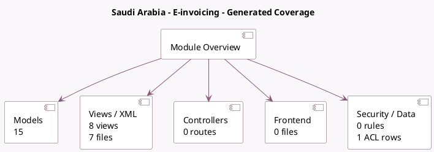

<!-- GENERATED:MODULE -->
---
tags: [odoo, community, module]
---

# Saudi Arabia - E-invoicing

- Scope: Community Addons
- Source: odoo/addons/l10n_sa_edi
- Dependencies: [[docs/Community Addons/account_edi/account_edi|account_edi]], [[docs/Community Addons/account_edi_ubl_cii/account_edi_ubl_cii|account_edi_ubl_cii]], [[docs/Community Addons/l10n_sa/l10n_sa|l10n_sa]], [[docs/Community Addons/base_vat/base_vat|base_vat]], [[docs/Community Addons/certificate/certificate|certificate]]

## Summary

        E-Invoicing, Universal Business Language
    

## Generated coverage

- Models: 15
- XML files with UI/data artifacts: 7
- Views: 8
- Actions: 1
- Menus: 0
- Rules (ir.rule): 0
- Access CSV entries: 1
- Controller units: 0
- Frontend asset files: 0

## Module map

## Detail notes

- Models: [[docs/Community Addons/l10n_sa_edi/Models|Models]] (15)
- Views and XML: [[docs/Community Addons/l10n_sa_edi/Views|Views]] (7 files)

## Key models

- `account.edi.document`
- `account.edi.format`
- `account.edi.xml.ubl_21.zatca`
- `account.journal`
- `account.move`
- `account.move.line`
- `account.move.send`
- `account.tax`
- `base.document.layout`
- `certificate.certificate`
- `ir.attachment`
- `l10n_sa_edi.otp.wizard`

## Navigation

- [[../Community Addons/Community Addons|Back to scope]]
- [[../../docs/docs|Back to docs]]

<!-- GENERATED:MODULE -->

