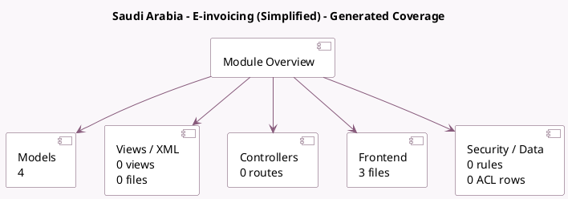

<!-- GENERATED:MODULE -->
---
tags: [odoo, community, module]
---

# Saudi Arabia - E-invoicing (Simplified)

- Scope: Community Addons
- Source: odoo/addons/l10n_sa_edi_pos
- Dependencies: [[docs/Community Addons/l10n_sa_pos/l10n_sa_pos|l10n_sa_pos]], [[docs/Community Addons/l10n_sa_edi/l10n_sa_edi|l10n_sa_edi]]

## Summary

        ZATCA E-Invoicing, support for PoS
    

## Generated coverage

- Models: 4
- XML files with UI/data artifacts: 0
- Views: 0
- Actions: 0
- Menus: 0
- Rules (ir.rule): 0
- Access CSV entries: 0
- Controller units: 0
- Frontend asset files: 3

## Module map

## Detail notes

- Models: [[docs/Community Addons/l10n_sa_edi_pos/Models|Models]] (4)
- Frontend: [[docs/Community Addons/l10n_sa_edi_pos/Frontend|Frontend]] (3 files)

## Key models

- `account.edi.xml.ubl_21.zatca`
- `pos.config`
- `pos.order`
- `res.company`

## Navigation

- [[../Community Addons/Community Addons|Back to scope]]
- [[../../docs/docs|Back to docs]]

<!-- GENERATED:MODULE -->

