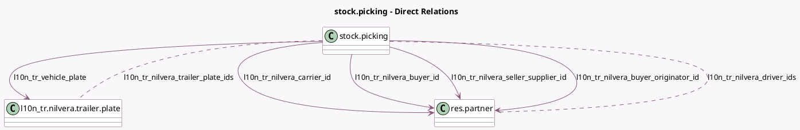

<!-- GENERATED:MODEL -->
---
tags: [odoo, community, generated, model]
---

# stock.picking

- Module: [[docs/Community Addons/l10n_tr_nilvera_edispatch/l10n_tr_nilvera_edispatch|l10n_tr_nilvera_edispatch]]
- Scope: Community Addons
- Defined in module: extension only
- Source files: `models/stock_picking.py`
- Python classes: `StockPicking`

## Field footprint

- Detected fields: 13
- Field types: `Char` x 2, `Date` x 1, `Json` x 1, `Many2many` x 2, `Many2one` x 5, `Selection` x 2
- Relation fields: 7

## Sample fields

- `l10n_tr_nilvera_buyer_id`: `Many2one` (comodel `res.partner`)
- `l10n_tr_nilvera_buyer_originator_id`: `Many2one` (comodel `res.partner`)
- `l10n_tr_nilvera_carrier_id`: `Many2one` (comodel `res.partner`)
- `l10n_tr_nilvera_delivery_date`: `Date`
- `l10n_tr_nilvera_delivery_notes`: `Char`
- `l10n_tr_nilvera_delivery_printed_number`: `Char`
- `l10n_tr_nilvera_dispatch_state`: `Selection`
- `l10n_tr_nilvera_dispatch_type`: `Selection`
- `l10n_tr_nilvera_driver_ids`: `Many2many` (comodel `res.partner`)
- `l10n_tr_nilvera_edispatch_warnings`: `Json` (compute `_compute_edispatch_warnings`)
- `l10n_tr_nilvera_seller_supplier_id`: `Many2one` (comodel `res.partner`)
- `l10n_tr_nilvera_trailer_plate_ids`: `Many2many` (comodel `l10n_tr.nilvera.trailer.plate`)
- `l10n_tr_vehicle_plate`: `Many2one` (comodel `l10n_tr.nilvera.trailer.plate`)

## Method hints

- Detected methods: 7
- Action methods: `action_generate_l10n_tr_edispatch_xml`, `action_mark_l10n_tr_edispatch_status`
- Compute methods: `_compute_edispatch_warnings`
- Onchange methods: none

## Direct relation diagram

## Navigation

- **Parent:** [[docs/Community Addons/l10n_tr_nilvera_edispatch/Models]]

<!-- GENERATED:MODEL -->
