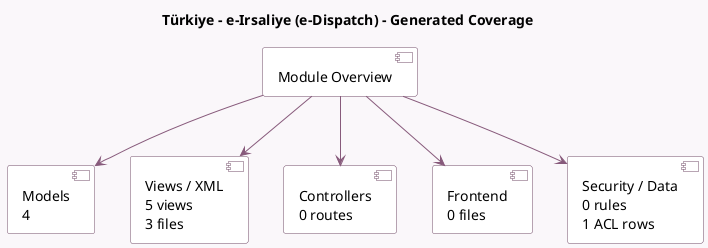

<!-- GENERATED:MODULE -->
---
tags: [odoo, community, module]
---

# Türkiye - e-Irsaliye (e-Dispatch)

- Scope: Community Addons
- Source: odoo/addons/l10n_tr_nilvera_edispatch
- Dependencies: [[docs/Community Addons/l10n_tr_nilvera/l10n_tr_nilvera|l10n_tr_nilvera]], [[docs/Community Addons/stock/stock|stock]]

## Generated coverage

- Models: 4
- XML files with UI/data artifacts: 3
- Views: 5
- Actions: 3
- Menus: 2
- Rules (ir.rule): 0
- Access CSV entries: 1
- Controller units: 0
- Frontend asset files: 0

## Module map

## Detail notes

- Models: [[docs/Community Addons/l10n_tr_nilvera_edispatch/Models|Models]] (4)
- Views and XML: [[docs/Community Addons/l10n_tr_nilvera_edispatch/Views|Views]] (3 files)

## Key models

- `l10n_tr.nilvera.trailer.plate`
- `res.partner`
- `stock.picking`
- `stock.picking.type`

## Navigation

- [[../Community Addons/Community Addons|Back to scope]]
- [[../../docs/docs|Back to docs]]

<!-- GENERATED:MODULE -->

