<!-- GENERATED:MODEL -->
---
tags: [odoo, community, generated, model]
---

# account.move

- Module: [[docs/Community Addons/l10n_tw_edi_ecpay/l10n_tw_edi_ecpay|l10n_tw_edi_ecpay]]
- Scope: Community Addons
- Defined in module: extension only
- Source files: `models/account_move.py`
- Python classes: `AccountMove`

## Field footprint

- Detected fields: 21
- Field types: `Binary` x 1, `Boolean` x 3, `Char` x 7, `Datetime` x 1, `Many2one` x 1, `Selection` x 8
- Relation fields: 1

## Sample fields

- `l10n_tw_edi_allowance_notify_way`: `Selection`
- `l10n_tw_edi_carrier_number`: `Char` (compute `_compute_carrier_info`, store `True`)
- `l10n_tw_edi_carrier_number_2`: `Char` (compute `_compute_carrier_info`, store `True`)
- `l10n_tw_edi_carrier_type`: `Selection` (compute `_compute_carrier_info`, store `True`)
- `l10n_tw_edi_clearance_mark`: `Selection`
- `l10n_tw_edi_ecpay_invoice_id`: `Char`
- `l10n_tw_edi_file`: `Binary`
- `l10n_tw_edi_file_id`: `Many2one` (comodel `ir.attachment`)
- `l10n_tw_edi_invalidate_reason`: `Char`
- `l10n_tw_edi_invoice_create_date`: `Datetime`
- `l10n_tw_edi_invoice_type`: `Selection` (compute `_compute_l10n_tw_edi_invoice_type`, store `True`)
- `l10n_tw_edi_is_b2b`: `Boolean` (compute `_compute_l10n_tw_edi_is_b2b`)
- `l10n_tw_edi_is_print`: `Boolean` (compute `_compute_is_print`, store `True`)
- `l10n_tw_edi_is_zero_tax_rate`: `Boolean` (compute `_compute_l10n_tw_edi_is_zero_tax_rate`)
- `l10n_tw_edi_love_code`: `Char` (compute `_compute_love_code`, store `True`)
- `l10n_tw_edi_refund_agreement_type`: `Selection`
- `l10n_tw_edi_refund_invoice_number`: `Char`
- `l10n_tw_edi_refund_state`: `Selection`
- `l10n_tw_edi_related_number`: `Char` (store `True`)
- `l10n_tw_edi_state`: `Selection`

## Method hints

- Detected methods: 26
- Action methods: none
- Compute methods: `_compute_carrier_info`, `_compute_is_print`, `_compute_l10n_tw_edi_invoice_type`, `_compute_l10n_tw_edi_is_b2b`, `_compute_l10n_tw_edi_is_zero_tax_rate`, `_compute_love_code`, `_compute_need_cancel_request`, `_compute_show_reset_to_draft_button`
- Onchange methods: none

## Direct relation diagram

```plantuml
@startuml
!define ODOO_COLOR_PRIMARY #714B67
!define ODOO_COLOR_ACCENT #875A7B
!define ODOO_COLOR_BG #FAF7FA

skinparam backgroundColor ODOO_COLOR_BG
skinparam defaultTextAlignment left
skinparam ArrowColor ODOO_COLOR_ACCENT
skinparam ClassBackgroundColor white
skinparam ClassBorderColor ODOO_COLOR_PRIMARY
skinparam ComponentBackgroundColor white
skinparam ComponentBorderColor ODOO_COLOR_PRIMARY
skinparam NoteBackgroundColor #FFF8FF
skinparam NoteBorderColor ODOO_COLOR_ACCENT
skinparam SequenceLifeLineBorderColor ODOO_COLOR_ACCENT
skinparam SequenceLifeLineBackgroundColor #FFFFFF
skinparam SequenceParticipantBorderColor ODOO_COLOR_PRIMARY
skinparam SequenceParticipantBackgroundColor #FFFFFF
skinparam sequence {
  ArrowColor ODOO_COLOR_ACCENT
  ActorBorderColor ODOO_COLOR_PRIMARY
}
title account.move - Direct Relations
class "account.move" as account_move
class "ir.attachment" as ir_attachment
account_move --> ir_attachment : l10n_tw_edi_file_id
@enduml
```

## Navigation

- **Parent:** [[docs/Community Addons/l10n_tw_edi_ecpay/Models]]

<!-- GENERATED:MODEL -->
