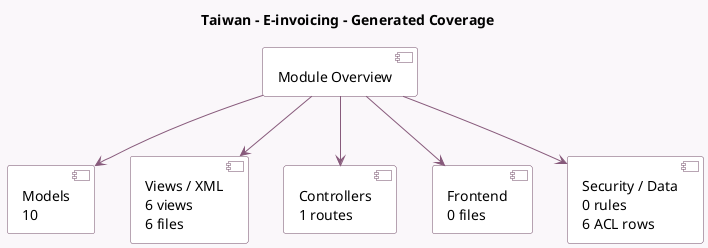

<!-- GENERATED:MODULE -->
---
tags: [odoo, community, module]
---

# Taiwan - E-invoicing

- Scope: Community Addons
- Source: odoo/addons/l10n_tw_edi_ecpay
- Dependencies: [[docs/Community Addons/l10n_tw/l10n_tw|l10n_tw]]

## Summary

E-invoicing using ECpay

## Generated coverage

- Models: 10
- XML files with UI/data artifacts: 6
- Views: 6
- Actions: 1
- Menus: 0
- Rules (ir.rule): 0
- Access CSV entries: 6
- Controller units: 1
- Frontend asset files: 0

## Module map

## Detail notes

- Models: [[docs/Community Addons/l10n_tw_edi_ecpay/Models|Models]] (10)
- Views and XML: [[docs/Community Addons/l10n_tw_edi_ecpay/Views|Views]] (6 files)
- Controllers: [[docs/Community Addons/l10n_tw_edi_ecpay/Controllers|Controllers]] (1)

## Key models

- `account.move`
- `account.move.line`
- `account.move.reversal`
- `account.move.send`
- `account.tax`
- `l10n_tw_edi.invoice.cancel`
- `l10n_tw_edi.invoice.print`
- `res.company`
- `res.config.settings`
- `res.partner`

## Navigation

- [[../Community Addons/Community Addons|Back to scope]]
- [[../../docs/docs|Back to docs]]

<!-- GENERATED:MODULE -->

