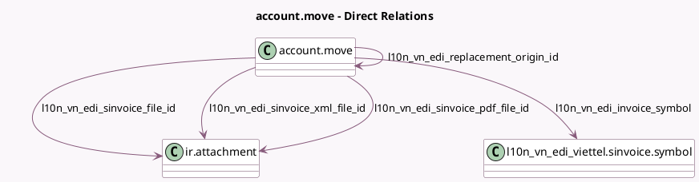

<!-- GENERATED:MODEL -->
---
tags: [odoo, community, generated, model]
---

# account.move

- Module: [[docs/Community Addons/l10n_vn_edi_viettel/l10n_vn_edi_viettel|l10n_vn_edi_viettel]]
- Scope: Community Addons
- Defined in module: extension only
- Source files: `models/account_move.py`
- Python classes: `AccountMove`

## Field footprint

- Detected fields: 17
- Field types: `Binary` x 3, `Char` x 5, `Datetime` x 2, `Many2one` x 5, `Selection` x 2
- Relation fields: 5

## Sample fields

- `l10n_vn_edi_adjustment_type`: `Selection`
- `l10n_vn_edi_agreement_document_date`: `Datetime`
- `l10n_vn_edi_agreement_document_name`: `Char`
- `l10n_vn_edi_invoice_number`: `Char`
- `l10n_vn_edi_invoice_state`: `Selection` (compute `_compute_l10n_vn_edi_invoice_state`, store `True`)
- `l10n_vn_edi_invoice_symbol`: `Many2one` (comodel `l10n_vn_edi_viettel.sinvoice.symbol`, compute `_compute_l10n_vn_edi_invoice_symbol`, store `True`)
- `l10n_vn_edi_invoice_transaction_id`: `Char`
- `l10n_vn_edi_issue_date`: `Datetime`
- `l10n_vn_edi_replacement_origin_id`: `Many2one` (comodel `account.move`)
- `l10n_vn_edi_reservation_code`: `Char`
- `l10n_vn_edi_reversed_entry_invoice_number`: `Char` (related `reversed_entry_id.l10n_vn_edi_invoice_number`)
- `l10n_vn_edi_sinvoice_file`: `Binary`
- `l10n_vn_edi_sinvoice_file_id`: `Many2one` (comodel `ir.attachment`)
- `l10n_vn_edi_sinvoice_pdf_file`: `Binary`
- `l10n_vn_edi_sinvoice_pdf_file_id`: `Many2one` (comodel `ir.attachment`)
- `l10n_vn_edi_sinvoice_xml_file`: `Binary`
- `l10n_vn_edi_sinvoice_xml_file_id`: `Many2one` (comodel `ir.attachment`)

## Method hints

- Detected methods: 32
- Action methods: `action_l10n_vn_edi_update_payment_status`
- Compute methods: `_compute_l10n_vn_edi_invoice_state`, `_compute_l10n_vn_edi_invoice_symbol`, `_compute_need_cancel_request`, `_compute_show_reset_to_draft_button`
- Onchange methods: none

## Direct relation diagram

## Navigation

- **Parent:** [[docs/Community Addons/l10n_vn_edi_viettel/Models]]

<!-- GENERATED:MODEL -->
