<!-- GENERATED:MODEL -->
---
tags: [odoo, community, generated, model]
---

# l10n_vn_edi_viettel.sinvoice.template

- Module: [[docs/Community Addons/l10n_vn_edi_viettel/l10n_vn_edi_viettel|l10n_vn_edi_viettel]]
- Scope: Community Addons
- Defined in module: yes
- Source files: `models/sinvoice.py`
- Python classes: `L10n_Vn_Edi_ViettelSinvoiceTemplate`
- Description: SInvoice template

## Field footprint

- Detected fields: 3
- Field types: `Char` x 1, `One2many` x 1, `Selection` x 1
- Relation fields: 1

## Sample fields

- `invoice_symbols_ids`: `One2many` (comodel `l10n_vn_edi_viettel.sinvoice.symbol`)
- `name`: `Char`
- `template_invoice_type`: `Selection`

## Method hints

- Detected methods: 1
- Action methods: none
- Compute methods: none
- Onchange methods: none

## Direct relation diagram

```plantuml
@startuml
!define ODOO_COLOR_PRIMARY #714B67
!define ODOO_COLOR_ACCENT #875A7B
!define ODOO_COLOR_BG #FAF7FA

skinparam backgroundColor ODOO_COLOR_BG
skinparam defaultTextAlignment left
skinparam ArrowColor ODOO_COLOR_ACCENT
skinparam ClassBackgroundColor white
skinparam ClassBorderColor ODOO_COLOR_PRIMARY
skinparam ComponentBackgroundColor white
skinparam ComponentBorderColor ODOO_COLOR_PRIMARY
skinparam NoteBackgroundColor #FFF8FF
skinparam NoteBorderColor ODOO_COLOR_ACCENT
skinparam SequenceLifeLineBorderColor ODOO_COLOR_ACCENT
skinparam SequenceLifeLineBackgroundColor #FFFFFF
skinparam SequenceParticipantBorderColor ODOO_COLOR_PRIMARY
skinparam SequenceParticipantBackgroundColor #FFFFFF
skinparam sequence {
  ArrowColor ODOO_COLOR_ACCENT
  ActorBorderColor ODOO_COLOR_PRIMARY
}
title l10n_vn_edi_viettel.sinvoice.template - Direct Relations
class "l10n_vn_edi_viettel.sinvoice.template" as l10n_vn_edi_viettel_sinvoice_template
class "l10n_vn_edi_viettel.sinvoice.symbol" as l10n_vn_edi_viettel_sinvoice_symbol
l10n_vn_edi_viettel_sinvoice_template --|> l10n_vn_edi_viettel_sinvoice_symbol : invoice_symbols_ids
@enduml
```

## Navigation

- **Parent:** [[docs/Community Addons/l10n_vn_edi_viettel/Models]]

<!-- GENERATED:MODEL -->
