<!-- GENERATED:MODEL -->
---
tags: [odoo, community, generated, model]
---

# res.config.settings

- Module: [[docs/Community Addons/l10n_vn_edi_viettel/l10n_vn_edi_viettel|l10n_vn_edi_viettel]]
- Scope: Community Addons
- Defined in module: extension only
- Source files: `models/res_config_settings.py`
- Python classes: `ResConfigSettings`

## Field footprint

- Detected fields: 3
- Field types: `Char` x 2, `Many2one` x 1
- Relation fields: 1

## Sample fields

- `l10n_vn_edi_default_symbol`: `Many2one` (comodel `l10n_vn_edi_viettel.sinvoice.symbol`, compute `_compute_l10n_vn_edi_default_symbol`)
- `l10n_vn_edi_password`: `Char` (related `company_id.l10n_vn_edi_password`)
- `l10n_vn_edi_username`: `Char` (related `company_id.l10n_vn_edi_username`)

## Method hints

- Detected methods: 2
- Action methods: none
- Compute methods: `_compute_l10n_vn_edi_default_symbol`
- Onchange methods: none

## Direct relation diagram

```plantuml
@startuml
!define ODOO_COLOR_PRIMARY #714B67
!define ODOO_COLOR_ACCENT #875A7B
!define ODOO_COLOR_BG #FAF7FA

skinparam backgroundColor ODOO_COLOR_BG
skinparam defaultTextAlignment left
skinparam ArrowColor ODOO_COLOR_ACCENT
skinparam ClassBackgroundColor white
skinparam ClassBorderColor ODOO_COLOR_PRIMARY
skinparam ComponentBackgroundColor white
skinparam ComponentBorderColor ODOO_COLOR_PRIMARY
skinparam NoteBackgroundColor #FFF8FF
skinparam NoteBorderColor ODOO_COLOR_ACCENT
skinparam SequenceLifeLineBorderColor ODOO_COLOR_ACCENT
skinparam SequenceLifeLineBackgroundColor #FFFFFF
skinparam SequenceParticipantBorderColor ODOO_COLOR_PRIMARY
skinparam SequenceParticipantBackgroundColor #FFFFFF
skinparam sequence {
  ArrowColor ODOO_COLOR_ACCENT
  ActorBorderColor ODOO_COLOR_PRIMARY
}
title res.config.settings - Direct Relations
class "res.config.settings" as res_config_settings
class "l10n_vn_edi_viettel.sinvoice.symbol" as l10n_vn_edi_viettel_sinvoice_symbol
res_config_settings --> l10n_vn_edi_viettel_sinvoice_symbol : l10n_vn_edi_default_symbol
@enduml
```

## Navigation

- **Parent:** [[docs/Community Addons/l10n_vn_edi_viettel/Models]]

<!-- GENERATED:MODEL -->
