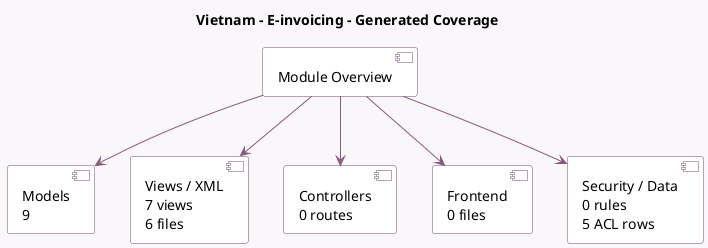

<!-- GENERATED:MODULE -->
---
tags: [odoo, community, module]
---

# Vietnam - E-invoicing

- Scope: Community Addons
- Source: odoo/addons/l10n_vn_edi_viettel
- Dependencies: [[docs/Community Addons/l10n_vn/l10n_vn|l10n_vn]]

## Summary

E-invoicing using SInvoice by Viettel

## Generated coverage

- Models: 9
- XML files with UI/data artifacts: 6
- Views: 7
- Actions: 3
- Menus: 3
- Rules (ir.rule): 0
- Access CSV entries: 5
- Controller units: 0
- Frontend asset files: 0

## Module map

## Detail notes

- Models: [[docs/Community Addons/l10n_vn_edi_viettel/Models|Models]] (9)
- Views and XML: [[docs/Community Addons/l10n_vn_edi_viettel/Views|Views]] (6 files)

## Key models

- `account.move`
- `account.move.reversal`
- `account.move.send`
- `l10n_vn_edi_viettel.cancellation`
- `l10n_vn_edi_viettel.sinvoice.symbol`
- `l10n_vn_edi_viettel.sinvoice.template`
- `res.company`
- `res.config.settings`
- `res.partner`

## Navigation

- [[../Community Addons/Community Addons|Back to scope]]
- [[../../docs/docs|Back to docs]]

<!-- GENERATED:MODULE -->

