<!-- GENERATED:MODEL -->
---
tags: [odoo, community, generated, model]
---

# link.tracker.click

- Module: [[docs/Community Addons/link_tracker/link_tracker|link_tracker]]
- Scope: Community Addons
- Defined in module: yes
- Source files: `models/link_tracker.py`
- Python classes: `LinkTrackerClick`
- Description: Link Tracker Click

## Field footprint

- Detected fields: 4
- Field types: `Char` x 1, `Many2one` x 3
- Relation fields: 3

## Sample fields

- `campaign_id`: `Many2one` (comodel `utm.campaign`, related `link_id.campaign_id`, store `True`)
- `country_id`: `Many2one` (comodel `res.country`)
- `ip`: `Char`
- `link_id`: `Many2one` (comodel `link.tracker`)

## Method hints

- Detected methods: 2
- Action methods: none
- Compute methods: none
- Onchange methods: none

## Direct relation diagram

```plantuml
@startuml
!define ODOO_COLOR_PRIMARY #714B67
!define ODOO_COLOR_ACCENT #875A7B
!define ODOO_COLOR_BG #FAF7FA

skinparam backgroundColor ODOO_COLOR_BG
skinparam defaultTextAlignment left
skinparam ArrowColor ODOO_COLOR_ACCENT
skinparam ClassBackgroundColor white
skinparam ClassBorderColor ODOO_COLOR_PRIMARY
skinparam ComponentBackgroundColor white
skinparam ComponentBorderColor ODOO_COLOR_PRIMARY
skinparam NoteBackgroundColor #FFF8FF
skinparam NoteBorderColor ODOO_COLOR_ACCENT
skinparam SequenceLifeLineBorderColor ODOO_COLOR_ACCENT
skinparam SequenceLifeLineBackgroundColor #FFFFFF
skinparam SequenceParticipantBorderColor ODOO_COLOR_PRIMARY
skinparam SequenceParticipantBackgroundColor #FFFFFF
skinparam sequence {
  ArrowColor ODOO_COLOR_ACCENT
  ActorBorderColor ODOO_COLOR_PRIMARY
}
title link.tracker.click - Direct Relations
class "link.tracker.click" as link_tracker_click
class "link.tracker" as link_tracker
class "res.country" as res_country
class "utm.campaign" as utm_campaign
link_tracker_click --> utm_campaign : campaign_id
link_tracker_click --> link_tracker : link_id
link_tracker_click --> res_country : country_id
@enduml
```

## Navigation

- **Parent:** [[docs/Community Addons/link_tracker/Models]]

<!-- GENERATED:MODEL -->
