<!-- GENERATED:MODEL -->
---
tags: [odoo, community, generated, model]
---

# link.tracker

- Module: [[docs/Community Addons/link_tracker/link_tracker|link_tracker]]
- Scope: Community Addons
- Defined in module: yes
- Source files: `models/link_tracker.py`
- Python classes: `LinkTracker`
- Description: Link Tracker
- Inherits: `utm.mixin`

## Field footprint

- Detected fields: 14
- Field types: `Char` x 8, `Integer` x 1, `Many2one` x 3, `One2many` x 2
- Relation fields: 5

## Sample fields

- `absolute_url`: `Char` (comodel `Absolute URL`, compute `_compute_absolute_url`)
- `campaign_id`: `Many2one`
- `code`: `Char` (compute `_compute_code`)
- `count`: `Integer` (compute `_compute_count`, store `True`)
- `label`: `Char`
- `link_click_ids`: `One2many` (comodel `link.tracker.click`)
- `link_code_ids`: `One2many` (comodel `link.tracker.code`)
- `medium_id`: `Many2one`
- `redirected_url`: `Char` (compute `_compute_redirected_url`)
- `short_url`: `Char` (compute `_compute_short_url`)
- `short_url_host`: `Char` (compute `_compute_short_url_host`)
- `source_id`: `Many2one`
- `title`: `Char` (store `True`)
- `url`: `Char`

## Method hints

- Detected methods: 17
- Action methods: `action_view_statistics`, `action_visit_page`
- Compute methods: `_compute_absolute_url`, `_compute_code`, `_compute_count`, `_compute_redirected_url`, `_compute_short_url`, `_compute_short_url_host`
- Onchange methods: none

## Direct relation diagram

```plantuml
@startuml
!define ODOO_COLOR_PRIMARY #714B67
!define ODOO_COLOR_ACCENT #875A7B
!define ODOO_COLOR_BG #FAF7FA

skinparam backgroundColor ODOO_COLOR_BG
skinparam defaultTextAlignment left
skinparam ArrowColor ODOO_COLOR_ACCENT
skinparam ClassBackgroundColor white
skinparam ClassBorderColor ODOO_COLOR_PRIMARY
skinparam ComponentBackgroundColor white
skinparam ComponentBorderColor ODOO_COLOR_PRIMARY
skinparam NoteBackgroundColor #FFF8FF
skinparam NoteBorderColor ODOO_COLOR_ACCENT
skinparam SequenceLifeLineBorderColor ODOO_COLOR_ACCENT
skinparam SequenceLifeLineBackgroundColor #FFFFFF
skinparam SequenceParticipantBorderColor ODOO_COLOR_PRIMARY
skinparam SequenceParticipantBackgroundColor #FFFFFF
skinparam sequence {
  ArrowColor ODOO_COLOR_ACCENT
  ActorBorderColor ODOO_COLOR_PRIMARY
}
title link.tracker - Direct Relations
class "link.tracker" as link_tracker
class "link.tracker.click" as link_tracker_click
class "link.tracker.code" as link_tracker_code
link_tracker --|> link_tracker_code : link_code_ids
link_tracker --|> link_tracker_click : link_click_ids
@enduml
```

## Navigation

- **Parent:** [[docs/Community Addons/link_tracker/Models]]

<!-- GENERATED:MODEL -->
