<!-- GENERATED:MODEL -->
---
tags: [odoo, community, generated, model]
---

# loyalty.card

- Module: [[docs/Community Addons/loyalty/loyalty|loyalty]]
- Scope: Community Addons
- Defined in module: yes
- Source files: `models/loyalty_card.py`
- Python classes: `LoyaltyCard`
- Description: Loyalty Coupon
- Inherits: `mail.thread`

## Field footprint

- Detected fields: 13
- Field types: `Boolean` x 1, `Char` x 3, `Date` x 1, `Float` x 1, `Integer` x 1, `Many2one` x 4, `One2many` x 1, `Selection` x 1
- Relation fields: 5

## Sample fields

- `active`: `Boolean`
- `code`: `Char`
- `company_id`: `Many2one` (related `program_id.company_id`, store `True`)
- `currency_id`: `Many2one` (related `program_id.currency_id`)
- `expiration_date`: `Date`
- `history_ids`: `One2many` (comodel `loyalty.history`)
- `partner_id`: `Many2one` (comodel `res.partner`)
- `point_name`: `Char` (related `program_id.portal_point_name`)
- `points`: `Float`
- `points_display`: `Char` (compute `_compute_points_display`)
- `program_id`: `Many2one` (comodel `loyalty.program`)
- `program_type`: `Selection` (related `program_id.program_type`)
- `use_count`: `Integer` (compute `_compute_use_count`)

## Method hints

- Detected methods: 17
- Action methods: `action_coupon_send`, `action_loyalty_update_balance`
- Compute methods: `_compute_display_name`, `_compute_points_display`, `_compute_use_count`
- Onchange methods: `_restrict_expiration_on_loyalty`

## Direct relation diagram

```plantuml
@startuml
!define ODOO_COLOR_PRIMARY #714B67
!define ODOO_COLOR_ACCENT #875A7B
!define ODOO_COLOR_BG #FAF7FA

skinparam backgroundColor ODOO_COLOR_BG
skinparam defaultTextAlignment left
skinparam ArrowColor ODOO_COLOR_ACCENT
skinparam ClassBackgroundColor white
skinparam ClassBorderColor ODOO_COLOR_PRIMARY
skinparam ComponentBackgroundColor white
skinparam ComponentBorderColor ODOO_COLOR_PRIMARY
skinparam NoteBackgroundColor #FFF8FF
skinparam NoteBorderColor ODOO_COLOR_ACCENT
skinparam SequenceLifeLineBorderColor ODOO_COLOR_ACCENT
skinparam SequenceLifeLineBackgroundColor #FFFFFF
skinparam SequenceParticipantBorderColor ODOO_COLOR_PRIMARY
skinparam SequenceParticipantBackgroundColor #FFFFFF
skinparam sequence {
  ArrowColor ODOO_COLOR_ACCENT
  ActorBorderColor ODOO_COLOR_PRIMARY
}
title loyalty.card - Direct Relations
class "loyalty.card" as loyalty_card
class "loyalty.history" as loyalty_history
class "loyalty.program" as loyalty_program
class "res.partner" as res_partner
loyalty_card --> loyalty_program : program_id
loyalty_card --> res_partner : partner_id
loyalty_card --|> loyalty_history : history_ids
@enduml
```

## Navigation

- **Parent:** [[docs/Community Addons/loyalty/Models]]

<!-- GENERATED:MODEL -->
