<!-- GENERATED:MODEL -->
---
tags: [odoo, community, generated, model]
---

# loyalty.generate.wizard

- Module: [[docs/Community Addons/loyalty/loyalty|loyalty]]
- Scope: Community Addons
- Defined in module: yes
- Source files: `wizard/loyalty_generate_wizard.py`
- Python classes: `LoyaltyGenerateWizard`
- Description: Generate Coupons

## Field footprint

- Detected fields: 12
- Field types: `Boolean` x 1, `Char` x 2, `Date` x 1, `Float` x 1, `Integer` x 1, `Many2many` x 2, `Many2one` x 1, `Selection` x 2, `Text` x 1
- Relation fields: 3

## Sample fields

- `confirmation_message`: `Char` (compute `_compute_confirmation_message`)
- `coupon_qty`: `Integer` (comodel `Quantity`, compute `_compute_coupon_qty`, store `True`)
- `customer_ids`: `Many2many` (comodel `res.partner`)
- `customer_tag_ids`: `Many2many` (comodel `res.partner.category`)
- `description`: `Text`
- `mode`: `Selection`
- `points_granted`: `Float` (comodel `Grant`)
- `points_name`: `Char` (related `program_id.portal_point_name`)
- `program_id`: `Many2one` (comodel `loyalty.program`)
- `program_type`: `Selection` (related `program_id.program_type`)
- `valid_until`: `Date`
- `will_send_mail`: `Boolean` (compute `_compute_will_send_mail`)

## Method hints

- Detected methods: 6
- Action methods: none
- Compute methods: `_compute_confirmation_message`, `_compute_coupon_qty`, `_compute_will_send_mail`
- Onchange methods: none

## Direct relation diagram

```plantuml
@startuml
!define ODOO_COLOR_PRIMARY #714B67
!define ODOO_COLOR_ACCENT #875A7B
!define ODOO_COLOR_BG #FAF7FA

skinparam backgroundColor ODOO_COLOR_BG
skinparam defaultTextAlignment left
skinparam ArrowColor ODOO_COLOR_ACCENT
skinparam ClassBackgroundColor white
skinparam ClassBorderColor ODOO_COLOR_PRIMARY
skinparam ComponentBackgroundColor white
skinparam ComponentBorderColor ODOO_COLOR_PRIMARY
skinparam NoteBackgroundColor #FFF8FF
skinparam NoteBorderColor ODOO_COLOR_ACCENT
skinparam SequenceLifeLineBorderColor ODOO_COLOR_ACCENT
skinparam SequenceLifeLineBackgroundColor #FFFFFF
skinparam SequenceParticipantBorderColor ODOO_COLOR_PRIMARY
skinparam SequenceParticipantBackgroundColor #FFFFFF
skinparam sequence {
  ArrowColor ODOO_COLOR_ACCENT
  ActorBorderColor ODOO_COLOR_PRIMARY
}
title loyalty.generate.wizard - Direct Relations
class "loyalty.generate.wizard" as loyalty_generate_wizard
class "loyalty.program" as loyalty_program
class "res.partner" as res_partner
class "res.partner.category" as res_partner_category
loyalty_generate_wizard --> loyalty_program : program_id
loyalty_generate_wizard .. res_partner : customer_ids
loyalty_generate_wizard .. res_partner_category : customer_tag_ids
@enduml
```

## Navigation

- **Parent:** [[docs/Community Addons/loyalty/Models]]

<!-- GENERATED:MODEL -->
