<!-- GENERATED:MODEL -->
---
tags: [odoo, community, generated, model]
---

# loyalty.history

- Module: [[docs/Community Addons/loyalty/loyalty|loyalty]]
- Scope: Community Addons
- Defined in module: yes
- Source files: `models/loyalty_history.py`
- Python classes: `LoyaltyHistory`
- Description: History for Loyalty cards and Ewallets

## Field footprint

- Detected fields: 7
- Field types: `Char` x 1, `Float` x 2, `Many2one` x 2, `Many2oneReference` x 1, `Text` x 1
- Relation fields: 2

## Sample fields

- `card_id`: `Many2one` (comodel `loyalty.card`)
- `company_id`: `Many2one` (related `card_id.company_id`)
- `description`: `Text`
- `issued`: `Float`
- `order_id`: `Many2oneReference`
- `order_model`: `Char`
- `used`: `Float`

## Method hints

- Detected methods: 2
- Action methods: none
- Compute methods: none
- Onchange methods: none

## Direct relation diagram

```plantuml
@startuml
!define ODOO_COLOR_PRIMARY #714B67
!define ODOO_COLOR_ACCENT #875A7B
!define ODOO_COLOR_BG #FAF7FA

skinparam backgroundColor ODOO_COLOR_BG
skinparam defaultTextAlignment left
skinparam ArrowColor ODOO_COLOR_ACCENT
skinparam ClassBackgroundColor white
skinparam ClassBorderColor ODOO_COLOR_PRIMARY
skinparam ComponentBackgroundColor white
skinparam ComponentBorderColor ODOO_COLOR_PRIMARY
skinparam NoteBackgroundColor #FFF8FF
skinparam NoteBorderColor ODOO_COLOR_ACCENT
skinparam SequenceLifeLineBorderColor ODOO_COLOR_ACCENT
skinparam SequenceLifeLineBackgroundColor #FFFFFF
skinparam SequenceParticipantBorderColor ODOO_COLOR_PRIMARY
skinparam SequenceParticipantBackgroundColor #FFFFFF
skinparam sequence {
  ArrowColor ODOO_COLOR_ACCENT
  ActorBorderColor ODOO_COLOR_PRIMARY
}
title loyalty.history - Direct Relations
class "loyalty.history" as loyalty_history
class "loyalty.card" as loyalty_card
loyalty_history --> loyalty_card : card_id
@enduml
```

## Navigation

- **Parent:** [[docs/Community Addons/loyalty/Models]]

<!-- GENERATED:MODEL -->
