<!-- GENERATED:MODEL -->
---
tags: [odoo, community, generated, model]
---

# loyalty.mail

- Module: [[docs/Community Addons/loyalty/loyalty|loyalty]]
- Scope: Community Addons
- Defined in module: yes
- Source files: `models/loyalty_mail.py`
- Python classes: `LoyaltyMail`
- Description: Loyalty Communication

## Field footprint

- Detected fields: 5
- Field types: `Boolean` x 1, `Float` x 1, `Many2one` x 2, `Selection` x 1
- Relation fields: 2

## Sample fields

- `active`: `Boolean`
- `mail_template_id`: `Many2one` (comodel `mail.template`)
- `points`: `Float`
- `program_id`: `Many2one` (comodel `loyalty.program`)
- `trigger`: `Selection`

## Method hints

- Detected methods: 0
- Action methods: none
- Compute methods: none
- Onchange methods: none

## Direct relation diagram

```plantuml
@startuml
!define ODOO_COLOR_PRIMARY #714B67
!define ODOO_COLOR_ACCENT #875A7B
!define ODOO_COLOR_BG #FAF7FA

skinparam backgroundColor ODOO_COLOR_BG
skinparam defaultTextAlignment left
skinparam ArrowColor ODOO_COLOR_ACCENT
skinparam ClassBackgroundColor white
skinparam ClassBorderColor ODOO_COLOR_PRIMARY
skinparam ComponentBackgroundColor white
skinparam ComponentBorderColor ODOO_COLOR_PRIMARY
skinparam NoteBackgroundColor #FFF8FF
skinparam NoteBorderColor ODOO_COLOR_ACCENT
skinparam SequenceLifeLineBorderColor ODOO_COLOR_ACCENT
skinparam SequenceLifeLineBackgroundColor #FFFFFF
skinparam SequenceParticipantBorderColor ODOO_COLOR_PRIMARY
skinparam SequenceParticipantBackgroundColor #FFFFFF
skinparam sequence {
  ArrowColor ODOO_COLOR_ACCENT
  ActorBorderColor ODOO_COLOR_PRIMARY
}
title loyalty.mail - Direct Relations
class "loyalty.mail" as loyalty_mail
class "loyalty.program" as loyalty_program
class "mail.template" as mail_template
loyalty_mail --> loyalty_program : program_id
loyalty_mail --> mail_template : mail_template_id
@enduml
```

## Navigation

- **Parent:** [[docs/Community Addons/loyalty/Models]]

<!-- GENERATED:MODEL -->
