<!-- GENERATED:MODEL -->
---
tags: [odoo, community, generated, model]
---

# loyalty.program

- Module: [[docs/Community Addons/loyalty/loyalty|loyalty]]
- Scope: Community Addons
- Defined in module: yes
- Source files: `models/loyalty_program.py`
- Python classes: `LoyaltyProgram`
- Description: Loyalty Program

## Field footprint

- Detected fields: 29
- Field types: `Boolean` x 6, `Char` x 4, `Date` x 2, `Integer` x 4, `Many2many` x 2, `Many2one` x 4, `One2many` x 4, `Selection` x 3
- Relation fields: 10

## Sample fields

- `active`: `Boolean`
- `applies_on`: `Selection` (compute `_compute_from_program_type`, store `True`)
- `available_on`: `Boolean` (store `False`)
- `communication_plan_ids`: `One2many` (comodel `loyalty.mail`, compute `_compute_from_program_type`, store `True`)
- `company_id`: `Many2one` (comodel `res.company`)
- `coupon_count`: `Integer` (compute `_compute_coupon_count`)
- `coupon_count_display`: `Char` (compute `_compute_coupon_count_display`)
- `coupon_ids`: `One2many` (comodel `loyalty.card`)
- `currency_id`: `Many2one` (comodel `res.currency`, compute `_compute_currency_id`, store `True`)
- `currency_symbol`: `Char` (related `currency_id.symbol`)
- `date_from`: `Date`
- `date_to`: `Date`
- `is_nominative`: `Boolean` (compute `_compute_is_nominative`)
- `is_payment_program`: `Boolean` (compute `_compute_is_payment_program`)
- `limit_usage`: `Boolean`
- `mail_template_id`: `Many2one` (comodel `mail.template`, compute `_compute_mail_template_id`)
- `max_usage`: `Integer`
- `name`: `Char`
- `payment_program_discount_product_id`: `Many2one` (comodel `product.product`, compute `_compute_payment_program_discount_product_id`)
- `portal_point_name`: `Char` (compute `_compute_portal_point_name`, store `True`)

## Method hints

- Detected methods: 25
- Action methods: `action_open_loyalty_cards`
- Compute methods: `_compute_coupon_count`, `_compute_coupon_count_display`, `_compute_currency_id`, `_compute_from_program_type`, `_compute_is_nominative`, `_compute_is_payment_program`, `_compute_mail_template_id`, `_compute_payment_program_discount_product_id`, and 2 more
- Onchange methods: none

## Direct relation diagram

```plantuml
@startuml
!define ODOO_COLOR_PRIMARY #714B67
!define ODOO_COLOR_ACCENT #875A7B
!define ODOO_COLOR_BG #FAF7FA

skinparam backgroundColor ODOO_COLOR_BG
skinparam defaultTextAlignment left
skinparam ArrowColor ODOO_COLOR_ACCENT
skinparam ClassBackgroundColor white
skinparam ClassBorderColor ODOO_COLOR_PRIMARY
skinparam ComponentBackgroundColor white
skinparam ComponentBorderColor ODOO_COLOR_PRIMARY
skinparam NoteBackgroundColor #FFF8FF
skinparam NoteBorderColor ODOO_COLOR_ACCENT
skinparam SequenceLifeLineBorderColor ODOO_COLOR_ACCENT
skinparam SequenceLifeLineBackgroundColor #FFFFFF
skinparam SequenceParticipantBorderColor ODOO_COLOR_PRIMARY
skinparam SequenceParticipantBackgroundColor #FFFFFF
skinparam sequence {
  ArrowColor ODOO_COLOR_ACCENT
  ActorBorderColor ODOO_COLOR_PRIMARY
}
title loyalty.program - Direct Relations
class "loyalty.program" as loyalty_program
class "loyalty.card" as loyalty_card
class "loyalty.mail" as loyalty_mail
class "loyalty.reward" as loyalty_reward
class "loyalty.rule" as loyalty_rule
class "mail.template" as mail_template
class "product.pricelist" as product_pricelist
class "product.product" as product_product
class "res.company" as res_company
class "res.currency" as res_currency
loyalty_program --> res_company : company_id
loyalty_program --> res_currency : currency_id
loyalty_program .. product_pricelist : pricelist_ids
loyalty_program --|> loyalty_rule : rule_ids
loyalty_program --|> loyalty_reward : reward_ids
loyalty_program --|> loyalty_mail : communication_plan_ids
loyalty_program --> mail_template : mail_template_id
loyalty_program --|> loyalty_card : coupon_ids
loyalty_program --> product_product : payment_program_discount_product_id
@enduml
```

## Navigation

- **Parent:** [[docs/Community Addons/loyalty/Models]]

<!-- GENERATED:MODEL -->
