<!-- GENERATED:MODEL -->
---
tags: [odoo, community, generated, model]
---

# loyalty.reward

- Module: [[docs/Community Addons/loyalty/loyalty|loyalty]]
- Scope: Community Addons
- Defined in module: yes
- Source files: `models/loyalty_reward.py`
- Python classes: `LoyaltyReward`
- Description: Loyalty Reward

## Field footprint

- Detected fields: 29
- Field types: `Boolean` x 5, `Char` x 4, `Float` x 2, `Integer` x 1, `Many2many` x 3, `Many2one` x 9, `Monetary` x 1, `Selection` x 4
- Relation fields: 12

## Sample fields

- `active`: `Boolean`
- `all_discount_product_ids`: `Many2many` (comodel `product.product`, compute `_compute_all_discount_product_ids`)
- `clear_wallet`: `Boolean`
- `company_id`: `Many2one` (related `program_id.company_id`, store `True`)
- `currency_id`: `Many2one` (related `program_id.currency_id`)
- `description`: `Char` (compute `_compute_description`, store `True`)
- `discount`: `Float`
- `discount_applicability`: `Selection`
- `discount_line_product_id`: `Many2one` (comodel `product.product`)
- `discount_max_amount`: `Monetary`
- `discount_mode`: `Selection`
- `discount_product_category_id`: `Many2one` (comodel `product.category`)
- `discount_product_domain`: `Char`
- `discount_product_ids`: `Many2many` (comodel `product.product`)
- `discount_product_tag_id`: `Many2one` (comodel `product.tag`)
- `is_global_discount`: `Boolean` (compute `_compute_is_global_discount`)
- `multi_product`: `Boolean` (compute `_compute_multi_product`)
- `point_name`: `Char` (related `program_id.portal_point_name`)
- `program_id`: `Many2one` (comodel `loyalty.program`)
- `program_type`: `Selection` (related `program_id.program_type`)

## Method hints

- Detected methods: 20
- Action methods: none
- Compute methods: `_compute_all_discount_product_ids`, `_compute_description`, `_compute_display_name`, `_compute_is_global_discount`, `_compute_multi_product`, `_compute_reward_product_domain`, `_compute_reward_product_uom_id`, `_compute_user_has_debug`
- Onchange methods: none

## Direct relation diagram

```plantuml
@startuml
!define ODOO_COLOR_PRIMARY #714B67
!define ODOO_COLOR_ACCENT #875A7B
!define ODOO_COLOR_BG #FAF7FA

skinparam backgroundColor ODOO_COLOR_BG
skinparam defaultTextAlignment left
skinparam ArrowColor ODOO_COLOR_ACCENT
skinparam ClassBackgroundColor white
skinparam ClassBorderColor ODOO_COLOR_PRIMARY
skinparam ComponentBackgroundColor white
skinparam ComponentBorderColor ODOO_COLOR_PRIMARY
skinparam NoteBackgroundColor #FFF8FF
skinparam NoteBorderColor ODOO_COLOR_ACCENT
skinparam SequenceLifeLineBorderColor ODOO_COLOR_ACCENT
skinparam SequenceLifeLineBackgroundColor #FFFFFF
skinparam SequenceParticipantBorderColor ODOO_COLOR_PRIMARY
skinparam SequenceParticipantBackgroundColor #FFFFFF
skinparam sequence {
  ArrowColor ODOO_COLOR_ACCENT
  ActorBorderColor ODOO_COLOR_PRIMARY
}
title loyalty.reward - Direct Relations
class "loyalty.reward" as loyalty_reward
class "loyalty.program" as loyalty_program
class "product.category" as product_category
class "product.product" as product_product
class "product.tag" as product_tag
class "uom.uom" as uom_uom
loyalty_reward --> loyalty_program : program_id
loyalty_reward .. product_product : discount_product_ids
loyalty_reward --> product_category : discount_product_category_id
loyalty_reward --> product_tag : discount_product_tag_id
loyalty_reward .. product_product : all_discount_product_ids
loyalty_reward --> product_product : discount_line_product_id
loyalty_reward --> product_product : reward_product_id
loyalty_reward --> product_tag : reward_product_tag_id
loyalty_reward .. product_product : reward_product_ids
loyalty_reward --> uom_uom : reward_product_uom_id
@enduml
```

## Navigation

- **Parent:** [[docs/Community Addons/loyalty/Models]]

<!-- GENERATED:MODEL -->
