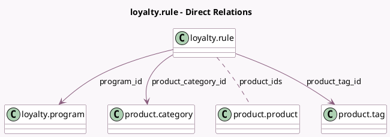

<!-- GENERATED:MODEL -->
---
tags: [odoo, community, generated, model]
---

# loyalty.rule

- Module: [[docs/Community Addons/loyalty/loyalty|loyalty]]
- Scope: Community Addons
- Defined in module: yes
- Source files: `models/loyalty_rule.py`
- Python classes: `LoyaltyRule`
- Description: Loyalty Rule

## Field footprint

- Detected fields: 19
- Field types: `Boolean` x 3, `Char` x 3, `Float` x 1, `Integer` x 1, `Many2many` x 1, `Many2one` x 5, `Monetary` x 1, `Selection` x 4
- Relation fields: 6

## Sample fields

- `active`: `Boolean`
- `code`: `Char` (compute `_compute_code`, store `True`)
- `company_id`: `Many2one` (related `program_id.company_id`, store `True`)
- `currency_id`: `Many2one` (related `program_id.currency_id`)
- `minimum_amount`: `Monetary`
- `minimum_amount_tax_mode`: `Selection`
- `minimum_qty`: `Integer`
- `mode`: `Selection` (compute `_compute_mode`, store `True`)
- `product_category_id`: `Many2one` (comodel `product.category`)
- `product_domain`: `Char`
- `product_ids`: `Many2many` (comodel `product.product`)
- `product_tag_id`: `Many2one` (comodel `product.tag`)
- `program_id`: `Many2one` (comodel `loyalty.program`)
- `program_type`: `Selection` (related `program_id.program_type`)
- `reward_point_amount`: `Float`
- `reward_point_mode`: `Selection`
- `reward_point_name`: `Char` (related `program_id.portal_point_name`)
- `reward_point_split`: `Boolean`
- `user_has_debug`: `Boolean` (compute `_compute_user_has_debug`)

## Method hints

- Detected methods: 10
- Action methods: none
- Compute methods: `_compute_amount`, `_compute_code`, `_compute_mode`, `_compute_user_has_debug`
- Onchange methods: none

## Direct relation diagram

## Navigation

- **Parent:** [[docs/Community Addons/loyalty/Models]]

<!-- GENERATED:MODEL -->
