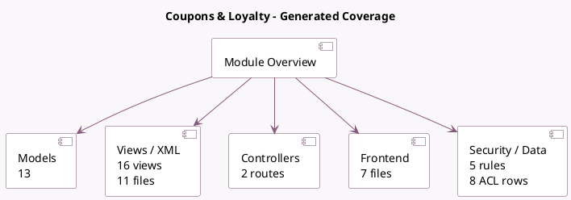

<!-- GENERATED:MODULE -->
---
tags: [odoo, community, module]
---

# Coupons & Loyalty

- Scope: Community Addons
- Source: odoo/addons/loyalty
- Dependencies: [[docs/Community Addons/product/product|product]], [[docs/Community Addons/portal/portal|portal]], [[docs/Community Addons/account/account|account]]

## Summary

Use discounts, gift card, eWallets and loyalty programs in different sales channels

## Generated coverage

- Models: 13
- XML files with UI/data artifacts: 11
- Views: 16
- Actions: 10
- Menus: 0
- Rules (ir.rule): 5
- Access CSV entries: 8
- Controller units: 1
- Frontend asset files: 7

## Module map

## Detail notes

- Models: [[docs/Community Addons/loyalty/Models|Models]] (13)
- Views and XML: [[docs/Community Addons/loyalty/Views|Views]] (11 files)
- Controllers: [[docs/Community Addons/loyalty/Controllers|Controllers]] (1)
- Frontend: [[docs/Community Addons/loyalty/Frontend|Frontend]] (7 files)

## Key models

- `base.partner.merge.automatic.wizard`
- `loyalty.card`
- `loyalty.card.update.balance`
- `loyalty.generate.wizard`
- `loyalty.history`
- `loyalty.mail`
- `loyalty.program`
- `loyalty.reward`
- `loyalty.rule`
- `product.pricelist`
- `product.product`
- `product.template`

## Navigation

- [[../Community Addons/Community Addons|Back to scope]]
- [[../../docs/docs|Back to docs]]

<!-- GENERATED:MODULE -->

