<!-- GENERATED:MODEL -->
---
tags: [odoo, community, generated, model]
---

# lunch.alert

- Module: [[docs/Community Addons/lunch/lunch|lunch]]
- Scope: Community Addons
- Defined in module: yes
- Source files: `models/lunch_alert.py`
- Python classes: `LunchAlert`
- Description: Lunch Alert

## Field footprint

- Detected fields: 19
- Field types: `Boolean` x 9, `Char` x 1, `Date` x 1, `Float` x 1, `Html` x 1, `Many2many` x 1, `Many2one` x 1, `Selection` x 4
- Relation fields: 2

## Sample fields

- `active`: `Boolean` (comodel `Active`)
- `available_today`: `Boolean` (comodel `Is Displayed Today`, compute `_compute_available_today`)
- `cron_id`: `Many2one` (comodel `ir.cron`)
- `fri`: `Boolean`
- `location_ids`: `Many2many` (comodel `lunch.location`)
- `message`: `Html` (comodel `Message`)
- `mode`: `Selection`
- `mon`: `Boolean`
- `name`: `Char` (comodel `Alert Name`)
- `notification_moment`: `Selection`
- `notification_time`: `Float`
- `recipients`: `Selection`
- `sat`: `Boolean`
- `sun`: `Boolean`
- `thu`: `Boolean`
- `tue`: `Boolean`
- `tz`: `Selection`
- `until`: `Date` (comodel `Show Until`)
- `wed`: `Boolean`

## Method hints

- Detected methods: 7
- Action methods: none
- Compute methods: `_compute_available_today`
- Onchange methods: none

## Direct relation diagram

```plantuml
@startuml
!define ODOO_COLOR_PRIMARY #714B67
!define ODOO_COLOR_ACCENT #875A7B
!define ODOO_COLOR_BG #FAF7FA

skinparam backgroundColor ODOO_COLOR_BG
skinparam defaultTextAlignment left
skinparam ArrowColor ODOO_COLOR_ACCENT
skinparam ClassBackgroundColor white
skinparam ClassBorderColor ODOO_COLOR_PRIMARY
skinparam ComponentBackgroundColor white
skinparam ComponentBorderColor ODOO_COLOR_PRIMARY
skinparam NoteBackgroundColor #FFF8FF
skinparam NoteBorderColor ODOO_COLOR_ACCENT
skinparam SequenceLifeLineBorderColor ODOO_COLOR_ACCENT
skinparam SequenceLifeLineBackgroundColor #FFFFFF
skinparam SequenceParticipantBorderColor ODOO_COLOR_PRIMARY
skinparam SequenceParticipantBackgroundColor #FFFFFF
skinparam sequence {
  ArrowColor ODOO_COLOR_ACCENT
  ActorBorderColor ODOO_COLOR_PRIMARY
}
title lunch.alert - Direct Relations
class "lunch.alert" as lunch_alert
class "ir.cron" as ir_cron
class "lunch.location" as lunch_location
lunch_alert --> ir_cron : cron_id
lunch_alert .. lunch_location : location_ids
@enduml
```

## Navigation

- **Parent:** [[docs/Community Addons/lunch/Models]]

<!-- GENERATED:MODEL -->
