<!-- GENERATED:MODEL -->
---
tags: [odoo, community, generated, model]
---

# lunch.cashmove.report

- Module: [[docs/Community Addons/lunch/lunch|lunch]]
- Scope: Community Addons
- Defined in module: yes
- Source files: `report/lunch_cashmove_report.py`
- Python classes: `LunchCashmoveReport`
- Description: Cashmoves report

## Field footprint

- Detected fields: 6
- Field types: `Date` x 1, `Float` x 1, `Id` x 1, `Many2one` x 2, `Text` x 1
- Relation fields: 2

## Sample fields

- `amount`: `Float` (comodel `Amount`)
- `currency_id`: `Many2one` (comodel `res.currency`)
- `date`: `Date` (comodel `Date`)
- `description`: `Text` (comodel `Description`)
- `id`: `Id`
- `user_id`: `Many2one` (comodel `res.users`)

## Method hints

- Detected methods: 2
- Action methods: none
- Compute methods: `_compute_display_name`
- Onchange methods: none

## Direct relation diagram

```plantuml
@startuml
!define ODOO_COLOR_PRIMARY #714B67
!define ODOO_COLOR_ACCENT #875A7B
!define ODOO_COLOR_BG #FAF7FA

skinparam backgroundColor ODOO_COLOR_BG
skinparam defaultTextAlignment left
skinparam ArrowColor ODOO_COLOR_ACCENT
skinparam ClassBackgroundColor white
skinparam ClassBorderColor ODOO_COLOR_PRIMARY
skinparam ComponentBackgroundColor white
skinparam ComponentBorderColor ODOO_COLOR_PRIMARY
skinparam NoteBackgroundColor #FFF8FF
skinparam NoteBorderColor ODOO_COLOR_ACCENT
skinparam SequenceLifeLineBorderColor ODOO_COLOR_ACCENT
skinparam SequenceLifeLineBackgroundColor #FFFFFF
skinparam SequenceParticipantBorderColor ODOO_COLOR_PRIMARY
skinparam SequenceParticipantBackgroundColor #FFFFFF
skinparam sequence {
  ArrowColor ODOO_COLOR_ACCENT
  ActorBorderColor ODOO_COLOR_PRIMARY
}
title lunch.cashmove.report - Direct Relations
class "lunch.cashmove.report" as lunch_cashmove_report
class "res.currency" as res_currency
class "res.users" as res_users
lunch_cashmove_report --> res_currency : currency_id
lunch_cashmove_report --> res_users : user_id
@enduml
```

## Navigation

- **Parent:** [[docs/Community Addons/lunch/Models]]

<!-- GENERATED:MODEL -->
