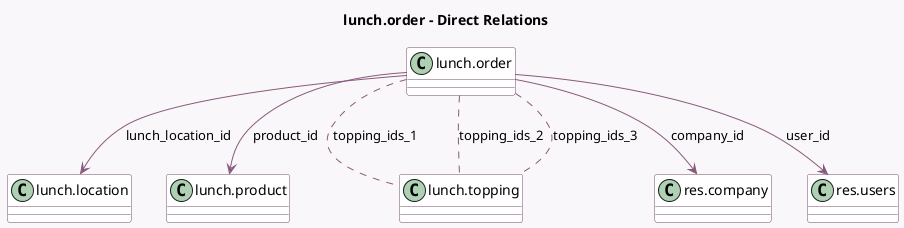

<!-- GENERATED:MODEL -->
---
tags: [odoo, community, generated, model]
---

# lunch.order

- Module: [[docs/Community Addons/lunch/lunch|lunch]]
- Scope: Community Addons
- Defined in module: yes
- Source files: `models/lunch_order.py`
- Python classes: `LunchOrder`
- Description: Lunch Order

## Field footprint

- Detected fields: 36
- Field types: `Boolean` x 10, `Char` x 4, `Date` x 1, `Float` x 1, `Html` x 1, `Image` x 2, `Many2many` x 3, `Many2one` x 7, `Monetary` x 1, `Selection` x 4, `Text` x 2
- Relation fields: 10

## Sample fields

- `active`: `Boolean` (comodel `Active`)
- `available_on_date`: `Boolean` (compute `_compute_available_on_date`)
- `available_today`: `Boolean` (related `supplier_id.available_today`)
- `available_toppings_1`: `Boolean` (compute `_compute_available_toppings`)
- `available_toppings_2`: `Boolean` (compute `_compute_available_toppings`)
- `available_toppings_3`: `Boolean` (compute `_compute_available_toppings`)
- `category_id`: `Many2one` (related `product_id.category_id`, store `True`)
- `company_id`: `Many2one` (comodel `res.company`)
- `currency_id`: `Many2one` (related `company_id.currency_id`, store `True`)
- `date`: `Date` (comodel `Order Date`)
- `display_add_button`: `Boolean` (compute `_compute_display_add_button`)
- `display_reorder_button`: `Boolean` (compute `_compute_display_reorder_button`)
- `display_toppings`: `Text` (comodel `Extras`, compute `_compute_display_toppings`, store `True`)
- `image_128`: `Image` (compute `_compute_product_images`)
- `image_1920`: `Image` (compute `_compute_product_images`)
- `lunch_location_id`: `Many2one` (comodel `lunch.location`)
- `name`: `Char` (related `product_id.name`)
- `note`: `Text` (comodel `Notes`)
- `notified`: `Boolean`
- `order_deadline_passed`: `Boolean` (compute `_compute_order_deadline_passed`)

## Method hints

- Detected methods: 24
- Action methods: `action_cancel`, `action_confirm`, `action_notify`, `action_order`, `action_reorder`, `action_reset`, `action_send`
- Compute methods: `_compute_available_on_date`, `_compute_available_toppings`, `_compute_display_add_button`, `_compute_display_reorder_button`, `_compute_display_toppings`, `_compute_order_deadline_passed`, `_compute_product_images`, `_compute_total_price`
- Onchange methods: none

## Direct relation diagram

## Navigation

- **Parent:** [[docs/Community Addons/lunch/Models]]

<!-- GENERATED:MODEL -->
