<!-- GENERATED:MODEL -->
---
tags: [odoo, community, generated, model]
---

# lunch.product.category

- Module: [[docs/Community Addons/lunch/lunch|lunch]]
- Scope: Community Addons
- Defined in module: yes
- Source files: `models/lunch_product_category.py`
- Python classes: `LunchProductCategory`
- Description: Lunch Product Category
- Inherits: `image.mixin`

## Field footprint

- Detected fields: 6
- Field types: `Boolean` x 1, `Char` x 1, `Image` x 1, `Integer` x 1, `Many2one` x 2
- Relation fields: 2

## Sample fields

- `active`: `Boolean`
- `company_id`: `Many2one` (comodel `res.company`)
- `currency_id`: `Many2one` (comodel `res.currency`, related `company_id.currency_id`)
- `image_1920`: `Image`
- `name`: `Char` (comodel `Product Category`)
- `product_count`: `Integer` (compute `_compute_product_count`)

## Method hints

- Detected methods: 5
- Action methods: `action_archive`, `action_unarchive`
- Compute methods: `_compute_product_count`
- Onchange methods: none

## Direct relation diagram

```plantuml
@startuml
!define ODOO_COLOR_PRIMARY #714B67
!define ODOO_COLOR_ACCENT #875A7B
!define ODOO_COLOR_BG #FAF7FA

skinparam backgroundColor ODOO_COLOR_BG
skinparam defaultTextAlignment left
skinparam ArrowColor ODOO_COLOR_ACCENT
skinparam ClassBackgroundColor white
skinparam ClassBorderColor ODOO_COLOR_PRIMARY
skinparam ComponentBackgroundColor white
skinparam ComponentBorderColor ODOO_COLOR_PRIMARY
skinparam NoteBackgroundColor #FFF8FF
skinparam NoteBorderColor ODOO_COLOR_ACCENT
skinparam SequenceLifeLineBorderColor ODOO_COLOR_ACCENT
skinparam SequenceLifeLineBackgroundColor #FFFFFF
skinparam SequenceParticipantBorderColor ODOO_COLOR_PRIMARY
skinparam SequenceParticipantBackgroundColor #FFFFFF
skinparam sequence {
  ArrowColor ODOO_COLOR_ACCENT
  ActorBorderColor ODOO_COLOR_PRIMARY
}
title lunch.product.category - Direct Relations
class "lunch.product.category" as lunch_product_category
class "res.company" as res_company
class "res.currency" as res_currency
lunch_product_category --> res_company : company_id
lunch_product_category --> res_currency : currency_id
@enduml
```

## Navigation

- **Parent:** [[docs/Community Addons/lunch/Models]]

<!-- GENERATED:MODEL -->
