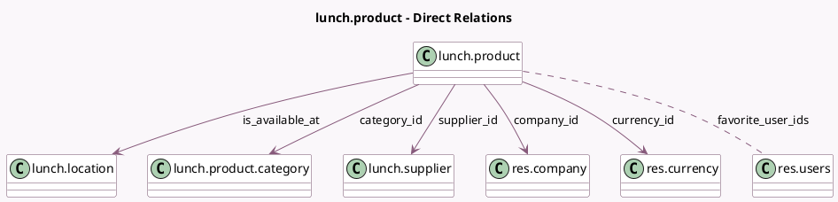

<!-- GENERATED:MODEL -->
---
tags: [odoo, community, generated, model]
---

# lunch.product

- Module: [[docs/Community Addons/lunch/lunch|lunch]]
- Scope: Community Addons
- Defined in module: yes
- Source files: `models/lunch_product.py`
- Python classes: `LunchProduct`
- Description: Lunch Product
- Inherits: `image.mixin`

## Field footprint

- Detected fields: 15
- Field types: `Boolean` x 3, `Char` x 1, `Date` x 2, `Float` x 1, `Html` x 1, `Image` x 1, `Many2many` x 1, `Many2one` x 5
- Relation fields: 6

## Sample fields

- `active`: `Boolean`
- `category_id`: `Many2one` (comodel `lunch.product.category`)
- `company_id`: `Many2one` (comodel `res.company`, related `supplier_id.company_id`, store `True`)
- `currency_id`: `Many2one` (comodel `res.currency`, related `company_id.currency_id`)
- `description`: `Html` (comodel `Description`)
- `favorite_user_ids`: `Many2many` (comodel `res.users`)
- `is_available_at`: `Many2one` (comodel `lunch.location`, compute `_compute_is_available_at`)
- `is_favorite`: `Boolean` (compute `_compute_is_favorite`)
- `is_new`: `Boolean` (compute `_compute_is_new`)
- `last_order_date`: `Date` (compute `_compute_last_order_date`)
- `name`: `Char` (comodel `Product Name`)
- `new_until`: `Date` (comodel `New Until`)
- `price`: `Float` (comodel `Price`)
- `product_image`: `Image` (compute `_compute_product_image`)
- `supplier_id`: `Many2one` (comodel `lunch.supplier`)

## Method hints

- Detected methods: 10
- Action methods: none
- Compute methods: `_compute_is_available_at`, `_compute_is_favorite`, `_compute_is_new`, `_compute_last_order_date`, `_compute_product_image`
- Onchange methods: none

## Direct relation diagram

## Navigation

- **Parent:** [[docs/Community Addons/lunch/Models]]

<!-- GENERATED:MODEL -->
