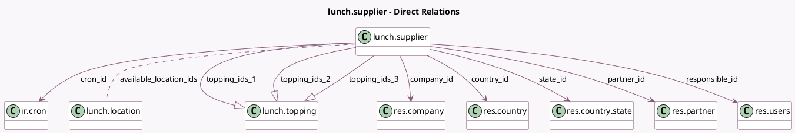

<!-- GENERATED:MODEL -->
---
tags: [odoo, community, generated, model]
---

# lunch.supplier

- Module: [[docs/Community Addons/lunch/lunch|lunch]]
- Scope: Community Addons
- Defined in module: yes
- Source files: `models/lunch_supplier.py`
- Python classes: `LunchSupplier`
- Description: Lunch Supplier
- Inherits: `mail.activity.mixin`, `mail.thread`

## Field footprint

- Detected fields: 42
- Field types: `Boolean` x 12, `Char` x 11, `Date` x 1, `Float` x 1, `Many2many` x 1, `Many2one` x 6, `One2many` x 3, `Selection` x 7
- Relation fields: 10

## Sample fields

- `active`: `Boolean`
- `automatic_email_time`: `Float` (comodel `Order Time`)
- `available_location_ids`: `Many2many` (comodel `lunch.location`)
- `available_today`: `Boolean` (comodel `This is True when if the supplier is available today`, compute `_compute_available_today`)
- `city`: `Char` (related `partner_id.city`)
- `company_id`: `Many2one` (comodel `res.company`, related `partner_id.company_id`, store `True`)
- `country_id`: `Many2one` (comodel `res.country`, related `partner_id.country_id`)
- `cron_id`: `Many2one` (comodel `ir.cron`)
- `delivery`: `Selection`
- `email`: `Char` (related `partner_id.email`)
- `email_formatted`: `Char` (related `partner_id.email_formatted`)
- `fri`: `Boolean`
- `moment`: `Selection`
- `mon`: `Boolean`
- `name`: `Char` (comodel `Name`, related `partner_id.name`)
- `order_deadline_passed`: `Boolean` (compute `_compute_order_deadline_passed`)
- `partner_id`: `Many2one` (comodel `res.partner`)
- `phone`: `Char` (related `partner_id.phone`)
- `recurrency_end_date`: `Date` (comodel `Until`)
- `responsible_id`: `Many2one` (comodel `res.users`)

## Method hints

- Detected methods: 15
- Action methods: `action_confirm_orders`, `action_send_orders`
- Compute methods: `_compute_available_today`, `_compute_buttons`, `_compute_display_name`, `_compute_order_deadline_passed`
- Onchange methods: none

## Direct relation diagram

## Navigation

- **Parent:** [[docs/Community Addons/lunch/Models]]

<!-- GENERATED:MODEL -->
