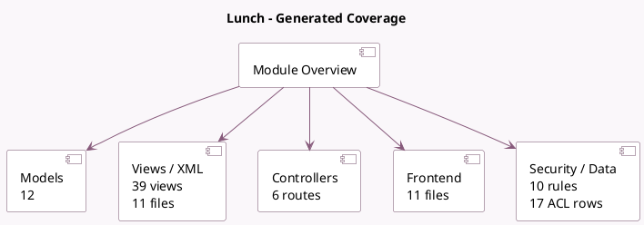

<!-- GENERATED:MODULE -->
---
tags: [odoo, community, module]
---

# Lunch

- Scope: Community Addons
- Source: odoo/addons/lunch
- Dependencies: [[docs/Community Addons/mail/mail|mail]]

## Summary

Handle lunch orders of your employees

## Generated coverage

- Models: 12
- XML files with UI/data artifacts: 11
- Views: 39
- Actions: 17
- Menus: 17
- Rules (ir.rule): 10
- Access CSV entries: 17
- Controller units: 1
- Frontend asset files: 11

## Module map

## Detail notes

- Models: [[docs/Community Addons/lunch/Models|Models]] (12)
- Views and XML: [[docs/Community Addons/lunch/Views|Views]] (11 files)
- Controllers: [[docs/Community Addons/lunch/Controllers|Controllers]] (1)
- Frontend: [[docs/Community Addons/lunch/Frontend|Frontend]] (11 files)

## Key models

- `lunch.alert`
- `lunch.cashmove`
- `lunch.cashmove.report`
- `lunch.location`
- `lunch.order`
- `lunch.product`
- `lunch.product.category`
- `lunch.supplier`
- `lunch.topping`
- `res.company`
- `res.config.settings`
- `res.users`

## Navigation

- [[../Community Addons/Community Addons|Back to scope]]
- [[../../docs/docs|Back to docs]]

<!-- GENERATED:MODULE -->

