<!-- GENERATED:MODEL -->
---
tags: [odoo, community, generated, model]
---

# discuss.call.history

- Module: [[docs/Community Addons/mail/mail|mail]]
- Scope: Community Addons
- Defined in module: yes
- Source files: `models/discuss/discuss_call_history.py`
- Python classes: `DiscussCallHistory`
- Description: Keep the call history

## Field footprint

- Detected fields: 5
- Field types: `Datetime` x 2, `Float` x 1, `Many2one` x 2
- Relation fields: 2

## Sample fields

- `channel_id`: `Many2one` (comodel `discuss.channel`)
- `duration_hour`: `Float` (compute `_compute_duration_hour`)
- `end_dt`: `Datetime`
- `start_call_message_id`: `Many2one` (comodel `mail.message`)
- `start_dt`: `Datetime`

## Method hints

- Detected methods: 1
- Action methods: none
- Compute methods: `_compute_duration_hour`
- Onchange methods: none

## Direct relation diagram

```plantuml
@startuml
!define ODOO_COLOR_PRIMARY #714B67
!define ODOO_COLOR_ACCENT #875A7B
!define ODOO_COLOR_BG #FAF7FA

skinparam backgroundColor ODOO_COLOR_BG
skinparam defaultTextAlignment left
skinparam ArrowColor ODOO_COLOR_ACCENT
skinparam ClassBackgroundColor white
skinparam ClassBorderColor ODOO_COLOR_PRIMARY
skinparam ComponentBackgroundColor white
skinparam ComponentBorderColor ODOO_COLOR_PRIMARY
skinparam NoteBackgroundColor #FFF8FF
skinparam NoteBorderColor ODOO_COLOR_ACCENT
skinparam SequenceLifeLineBorderColor ODOO_COLOR_ACCENT
skinparam SequenceLifeLineBackgroundColor #FFFFFF
skinparam SequenceParticipantBorderColor ODOO_COLOR_PRIMARY
skinparam SequenceParticipantBackgroundColor #FFFFFF
skinparam sequence {
  ArrowColor ODOO_COLOR_ACCENT
  ActorBorderColor ODOO_COLOR_PRIMARY
}
title discuss.call.history - Direct Relations
class "discuss.call.history" as discuss_call_history
class "discuss.channel" as discuss_channel
class "mail.message" as mail_message
discuss_call_history --> discuss_channel : channel_id
discuss_call_history --> mail_message : start_call_message_id
@enduml
```

## Navigation

- **Parent:** [[docs/Community Addons/mail/Models]]

<!-- GENERATED:MODEL -->
