<!-- GENERATED:MODEL -->
---
tags: [odoo, community, generated, model]
---

# discuss.channel

- Module: [[docs/Community Addons/mail/mail|mail]]
- Scope: Community Addons
- Defined in module: yes
- Source files: `models/discuss/discuss_channel.py`
- Python classes: `DiscussChannel`
- Description: Discussion Channel
- Inherits: `bus.listener.mixin`, `mail.thread`

## Field footprint

- Detected fields: 30
- Field types: `Boolean` x 3, `Char` x 6, `Datetime` x 1, `Image` x 2, `Integer` x 2, `Many2many` x 2, `Many2one` x 4, `One2many` x 7, `Selection` x 2, `Text` x 1
- Relation fields: 13

## Sample fields

- `active`: `Boolean`
- `avatar_128`: `Image` (comodel `Avatar`, compute `_compute_avatar_128`)
- `avatar_cache_key`: `Char` (compute `_compute_avatar_cache_key`)
- `call_history_ids`: `One2many` (comodel `discuss.call.history`)
- `channel_member_ids`: `One2many` (comodel `discuss.channel.member`)
- `channel_name_member_ids`: `One2many` (comodel `discuss.channel.member`, compute `_compute_channel_name_member_ids`)
- `channel_partner_ids`: `Many2many` (comodel `res.partner`, compute `_compute_channel_partner_ids`)
- `channel_type`: `Selection`
- `default_display_mode`: `Selection`
- `description`: `Text` (comodel `Description`)
- `from_message_id`: `Many2one` (comodel `mail.message`)
- `group_ids`: `Many2many` (comodel `res.groups`)
- `group_public_id`: `Many2one` (comodel `res.groups`, compute `_compute_group_public_id`, store `True`)
- `image_128`: `Image` (comodel `Image`)
- `invitation_url`: `Char` (comodel `Invitation URL`, compute `_compute_invitation_url`)
- `invited_member_ids`: `One2many` (comodel `discuss.channel.member`, compute `_compute_invited_member_ids`)
- `is_editable`: `Boolean` (comodel `Is Editable`, compute `_compute_is_editable`)
- `is_member`: `Boolean` (comodel `Is Member`, compute `_compute_is_member`)
- `last_interest_dt`: `Datetime` (comodel `Last Interest`)
- `member_count`: `Integer` (compute `_compute_member_count`)

## Method hints

- Detected methods: 83
- Action methods: `action_unfollow`
- Compute methods: `_compute_avatar_128`, `_compute_avatar_cache_key`, `_compute_channel_name_member_ids`, `_compute_channel_partner_ids`, `_compute_display_name`, `_compute_group_public_id`, `_compute_invitation_url`, `_compute_invited_member_ids`, and 5 more
- Onchange methods: none

## Direct relation diagram

```plantuml
@startuml
!define ODOO_COLOR_PRIMARY #714B67
!define ODOO_COLOR_ACCENT #875A7B
!define ODOO_COLOR_BG #FAF7FA

skinparam backgroundColor ODOO_COLOR_BG
skinparam defaultTextAlignment left
skinparam ArrowColor ODOO_COLOR_ACCENT
skinparam ClassBackgroundColor white
skinparam ClassBorderColor ODOO_COLOR_PRIMARY
skinparam ComponentBackgroundColor white
skinparam ComponentBorderColor ODOO_COLOR_PRIMARY
skinparam NoteBackgroundColor #FFF8FF
skinparam NoteBorderColor ODOO_COLOR_ACCENT
skinparam SequenceLifeLineBorderColor ODOO_COLOR_ACCENT
skinparam SequenceLifeLineBackgroundColor #FFFFFF
skinparam SequenceParticipantBorderColor ODOO_COLOR_PRIMARY
skinparam SequenceParticipantBackgroundColor #FFFFFF
skinparam sequence {
  ArrowColor ODOO_COLOR_ACCENT
  ActorBorderColor ODOO_COLOR_PRIMARY
}
title discuss.channel - Direct Relations
class "discuss.channel" as discuss_channel
class "discuss.call.history" as discuss_call_history
class "discuss.channel" as discuss_channel
class "discuss.channel.member" as discuss_channel_member
class "discuss.channel.rtc.session" as discuss_channel_rtc_session
class "mail.message" as mail_message
class "res.groups" as res_groups
class "res.partner" as res_partner
discuss_channel .. res_partner : channel_partner_ids
discuss_channel --|> discuss_channel_member : channel_member_ids
discuss_channel --> discuss_channel : parent_channel_id
discuss_channel --|> discuss_channel : sub_channel_ids
discuss_channel --> mail_message : from_message_id
discuss_channel --|> mail_message : pinned_message_ids
discuss_channel --|> discuss_channel_rtc_session : rtc_session_ids
discuss_channel --|> discuss_call_history : call_history_ids
discuss_channel --> discuss_channel_member : self_member_id
discuss_channel --|> discuss_channel_member : invited_member_ids
discuss_channel .. res_groups : group_ids
discuss_channel --> res_groups : group_public_id
discuss_channel --|> discuss_channel_member : channel_name_member_ids
@enduml
```

## Navigation

- **Parent:** [[docs/Community Addons/mail/Models]]

<!-- GENERATED:MODEL -->
