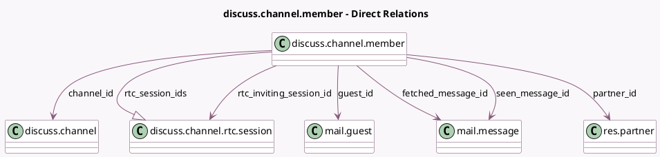

<!-- GENERATED:MODEL -->
---
tags: [odoo, community, generated, model]
---

# discuss.channel.member

- Module: [[docs/Community Addons/mail/mail|mail]]
- Scope: Community Addons
- Defined in module: yes
- Source files: `models/discuss/discuss_channel_member.py`
- Python classes: `DiscussChannelMember`
- Description: Channel Member
- Inherits: `bus.listener.mixin`

## Field footprint

- Detected fields: 17
- Field types: `Boolean` x 2, `Char` x 1, `Datetime` x 4, `Integer` x 2, `Many2one` x 6, `One2many` x 1, `Selection` x 1
- Relation fields: 7

## Sample fields

- `channel_id`: `Many2one` (comodel `discuss.channel`)
- `custom_channel_name`: `Char` (comodel `Custom channel name`)
- `custom_notifications`: `Selection`
- `fetched_message_id`: `Many2one` (comodel `mail.message`)
- `guest_id`: `Many2one` (comodel `mail.guest`)
- `is_pinned`: `Boolean` (comodel `Is pinned on the interface`, compute `_compute_is_pinned`)
- `is_self`: `Boolean` (compute `_compute_is_self`)
- `last_interest_dt`: `Datetime` (comodel `Last Interest`)
- `last_seen_dt`: `Datetime` (comodel `Last seen date`)
- `message_unread_counter`: `Integer` (comodel `Unread Messages Counter`, compute `_compute_message_unread`)
- `mute_until_dt`: `Datetime` (comodel `Mute notifications until`)
- `new_message_separator`: `Integer`
- `partner_id`: `Many2one` (comodel `res.partner`)
- `rtc_inviting_session_id`: `Many2one` (comodel `discuss.channel.rtc.session`)
- `rtc_session_ids`: `One2many` (comodel `discuss.channel.rtc.session`)
- `seen_message_id`: `Many2one` (comodel `mail.message`)
- `unpin_dt`: `Datetime` (comodel `Unpin date`)

## Method hints

- Detected methods: 32
- Action methods: none
- Compute methods: `_compute_display_name`, `_compute_is_pinned`, `_compute_is_self`, `_compute_message_unread`
- Onchange methods: none

## Direct relation diagram

## Navigation

- **Parent:** [[docs/Community Addons/mail/Models]]

<!-- GENERATED:MODEL -->
