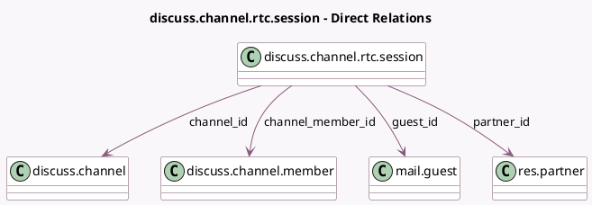

<!-- GENERATED:MODEL -->
---
tags: [odoo, community, generated, model]
---

# discuss.channel.rtc.session

- Module: [[docs/Community Addons/mail/mail|mail]]
- Scope: Community Addons
- Defined in module: yes
- Source files: `models/discuss/discuss_channel_rtc_session.py`
- Python classes: `DiscussChannelRtcSession`
- Description: Mail RTC session
- Inherits: `bus.listener.mixin`

## Field footprint

- Detected fields: 9
- Field types: `Boolean` x 4, `Datetime` x 1, `Many2one` x 4
- Relation fields: 4

## Sample fields

- `channel_id`: `Many2one` (comodel `discuss.channel`, related `channel_member_id.channel_id`, store `True`)
- `channel_member_id`: `Many2one` (comodel `discuss.channel.member`)
- `guest_id`: `Many2one` (comodel `mail.guest`, related `channel_member_id.guest_id`)
- `is_camera_on`: `Boolean`
- `is_deaf`: `Boolean`
- `is_muted`: `Boolean`
- `is_screen_sharing_on`: `Boolean`
- `partner_id`: `Many2one` (comodel `res.partner`, related `channel_member_id.partner_id`, store `True`)
- `write_date`: `Datetime` (comodel `Last Updated On`)

## Method hints

- Detected methods: 11
- Action methods: `action_disconnect`
- Compute methods: none
- Onchange methods: none

## Direct relation diagram

## Navigation

- **Parent:** [[docs/Community Addons/mail/Models]]

<!-- GENERATED:MODEL -->
