<!-- GENERATED:MODEL -->
---
tags: [odoo, community, generated, model]
---

# fetchmail.server

- Module: [[docs/Community Addons/mail/mail|mail]]
- Scope: Community Addons
- Defined in module: yes
- Source files: `models/fetchmail.py`
- Python classes: `FetchmailServer`
- Description: Incoming Mail Server

## Field footprint

- Detected fields: 20
- Field types: `Boolean` x 4, `Char` x 5, `Datetime` x 2, `Integer` x 2, `Many2one` x 1, `One2many` x 1, `Selection` x 2, `Text` x 3
- Relation fields: 2

## Sample fields

- `active`: `Boolean` (comodel `Active`)
- `attach`: `Boolean` (comodel `Keep Attachments`)
- `configuration`: `Text` (comodel `Configuration`)
- `date`: `Datetime`
- `error_date`: `Datetime`
- `error_message`: `Text`
- `is_ssl`: `Boolean` (comodel `SSL/TLS`)
- `message_ids`: `One2many` (comodel `mail.mail`)
- `name`: `Char` (comodel `Name`)
- `object_id`: `Many2one` (comodel `ir.model`)
- `original`: `Boolean` (comodel `Keep Original`)
- `password`: `Char`
- `port`: `Integer`
- `priority`: `Integer`
- `script`: `Char`
- `server`: `Char`
- `server_type`: `Selection`
- `server_type_info`: `Text` (comodel `Server Type Info`, compute `_compute_server_type_info`)
- `state`: `Selection`
- `user`: `Char`

## Method hints

- Detected methods: 14
- Action methods: none
- Compute methods: `_compute_server_type_info`
- Onchange methods: `onchange_server_type`

## Direct relation diagram

```plantuml
@startuml
!define ODOO_COLOR_PRIMARY #714B67
!define ODOO_COLOR_ACCENT #875A7B
!define ODOO_COLOR_BG #FAF7FA

skinparam backgroundColor ODOO_COLOR_BG
skinparam defaultTextAlignment left
skinparam ArrowColor ODOO_COLOR_ACCENT
skinparam ClassBackgroundColor white
skinparam ClassBorderColor ODOO_COLOR_PRIMARY
skinparam ComponentBackgroundColor white
skinparam ComponentBorderColor ODOO_COLOR_PRIMARY
skinparam NoteBackgroundColor #FFF8FF
skinparam NoteBorderColor ODOO_COLOR_ACCENT
skinparam SequenceLifeLineBorderColor ODOO_COLOR_ACCENT
skinparam SequenceLifeLineBackgroundColor #FFFFFF
skinparam SequenceParticipantBorderColor ODOO_COLOR_PRIMARY
skinparam SequenceParticipantBackgroundColor #FFFFFF
skinparam sequence {
  ArrowColor ODOO_COLOR_ACCENT
  ActorBorderColor ODOO_COLOR_PRIMARY
}
title fetchmail.server - Direct Relations
class "fetchmail.server" as fetchmail_server
class "ir.model" as ir_model
class "mail.mail" as mail_mail
fetchmail_server --> ir_model : object_id
fetchmail_server --|> mail_mail : message_ids
@enduml
```

## Navigation

- **Parent:** [[docs/Community Addons/mail/Models]]

<!-- GENERATED:MODEL -->
