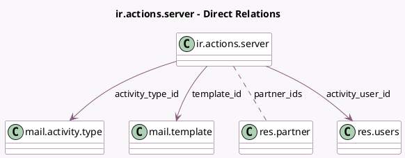

<!-- GENERATED:MODEL -->
---
tags: [odoo, community, generated, model]
---

# ir.actions.server

- Module: [[docs/Community Addons/mail/mail|mail]]
- Scope: Community Addons
- Defined in module: yes
- Source files: `models/ir_actions_server.py`
- Python classes: `IrActionsServer`
- Description: Server Action
- Inherits: `mail.activity.mixin`, `mail.thread`

## Field footprint

- Detected fields: 23
- Field types: `Boolean` x 1, `Char` x 6, `Html` x 1, `Integer` x 1, `Many2many` x 1, `Many2one` x 6, `Selection` x 6, `Text` x 1
- Relation fields: 7

## Sample fields

- `activity_date_deadline_range`: `Integer` (compute `_compute_activity_info`, store `True`)
- `activity_date_deadline_range_type`: `Selection` (compute `_compute_activity_info`, store `True`)
- `activity_note`: `Html` (comodel `Note`, compute `_compute_activity_info`, store `True`)
- `activity_summary`: `Char` (comodel `Title`, compute `_compute_activity_info`, store `True`)
- `activity_type_id`: `Many2one` (comodel `mail.activity.type`, compute `_compute_activity_info`, store `True`)
- `activity_user_field_name`: `Char` (comodel `User Field`, compute `_compute_activity_user_info`, store `True`)
- `activity_user_id`: `Many2one` (comodel `res.users`, compute `_compute_activity_user_info`, store `True`)
- `activity_user_type`: `Selection` (compute `_compute_activity_info`, store `True`)
- `crud_model_id`: `Many2one`
- `evaluation_type`: `Selection`
- `followers_partner_field_name`: `Char` (compute `_compute_followers_info`, store `True`)
- `followers_type`: `Selection` (compute `_compute_followers_type`, store `True`)
- `link_field_id`: `Many2one`
- `mail_post_autofollow`: `Boolean` (comodel `Subscribe Recipients`, compute `_compute_mail_post_autofollow`, store `True`)
- `mail_post_method`: `Selection` (compute `_compute_mail_post_method`, store `True`)
- `model_id`: `Many2one`
- `name`: `Char`
- `partner_ids`: `Many2many` (comodel `res.partner`, compute `_compute_followers_info`, store `True`)
- `state`: `Selection`
- `template_id`: `Many2one` (comodel `mail.template`, compute `_compute_template_id`, store `True`)

## Method hints

- Detected methods: 18
- Action methods: none
- Compute methods: `_compute_activity_info`, `_compute_activity_user_info`, `_compute_available_model_ids`, `_compute_followers_info`, `_compute_followers_type`, `_compute_mail_post_autofollow`, `_compute_mail_post_method`, `_compute_template_id`
- Onchange methods: none

## Direct relation diagram

## Navigation

- **Parent:** [[docs/Community Addons/mail/Models]]

<!-- GENERATED:MODEL -->
