<!-- GENERATED:MODEL -->
---
tags: [odoo, community, generated, model]
---

# ir.attachment

- Module: [[docs/Community Addons/mail/mail|mail]]
- Scope: Community Addons
- Defined in module: extension only
- Source files: `models/discuss/ir_attachment.py`, `models/ir_attachment.py`
- Python classes: `IrAttachment`

## Field footprint

- Detected fields: 3
- Field types: `Boolean` x 1, `Image` x 1, `One2many` x 1
- Relation fields: 1

## Sample fields

- `has_thumbnail`: `Boolean` (compute `_compute_has_thumbnail`)
- `thumbnail`: `Image`
- `voice_ids`: `One2many` (comodel `discuss.voice.metadata`)

## Method hints

- Detected methods: 11
- Action methods: none
- Compute methods: `_compute_has_thumbnail`
- Onchange methods: none

## Direct relation diagram

```plantuml
@startuml
!define ODOO_COLOR_PRIMARY #714B67
!define ODOO_COLOR_ACCENT #875A7B
!define ODOO_COLOR_BG #FAF7FA

skinparam backgroundColor ODOO_COLOR_BG
skinparam defaultTextAlignment left
skinparam ArrowColor ODOO_COLOR_ACCENT
skinparam ClassBackgroundColor white
skinparam ClassBorderColor ODOO_COLOR_PRIMARY
skinparam ComponentBackgroundColor white
skinparam ComponentBorderColor ODOO_COLOR_PRIMARY
skinparam NoteBackgroundColor #FFF8FF
skinparam NoteBorderColor ODOO_COLOR_ACCENT
skinparam SequenceLifeLineBorderColor ODOO_COLOR_ACCENT
skinparam SequenceLifeLineBackgroundColor #FFFFFF
skinparam SequenceParticipantBorderColor ODOO_COLOR_PRIMARY
skinparam SequenceParticipantBackgroundColor #FFFFFF
skinparam sequence {
  ArrowColor ODOO_COLOR_ACCENT
  ActorBorderColor ODOO_COLOR_PRIMARY
}
title ir.attachment - Direct Relations
class "ir.attachment" as ir_attachment
class "discuss.voice.metadata" as discuss_voice_metadata
ir_attachment --|> discuss_voice_metadata : voice_ids
@enduml
```

## Navigation

- **Parent:** [[docs/Community Addons/mail/Models]]

<!-- GENERATED:MODEL -->
