<!-- GENERATED:MODEL -->
---
tags: [odoo, community, generated, model]
---

# ir.mail_server

- Module: [[docs/Community Addons/mail/mail|mail]]
- Scope: Community Addons
- Defined in module: extension only
- Source files: `models/ir_mail_server.py`
- Python classes: `IrMail_Server`

## Field footprint

- Detected fields: 4
- Field types: `Datetime` x 1, `Integer` x 1, `Many2one` x 1, `One2many` x 1
- Relation fields: 2

## Sample fields

- `mail_template_ids`: `One2many` (comodel `mail.template`)
- `owner_limit_count`: `Integer` (comodel `Owner Limit Count`)
- `owner_limit_time`: `Datetime` (comodel `Owner Limit Time`)
- `owner_user_id`: `Many2one` (comodel `res.users`)

## Method hints

- Detected methods: 8
- Action methods: none
- Compute methods: none
- Onchange methods: none

## Direct relation diagram

```plantuml
@startuml
!define ODOO_COLOR_PRIMARY #714B67
!define ODOO_COLOR_ACCENT #875A7B
!define ODOO_COLOR_BG #FAF7FA

skinparam backgroundColor ODOO_COLOR_BG
skinparam defaultTextAlignment left
skinparam ArrowColor ODOO_COLOR_ACCENT
skinparam ClassBackgroundColor white
skinparam ClassBorderColor ODOO_COLOR_PRIMARY
skinparam ComponentBackgroundColor white
skinparam ComponentBorderColor ODOO_COLOR_PRIMARY
skinparam NoteBackgroundColor #FFF8FF
skinparam NoteBorderColor ODOO_COLOR_ACCENT
skinparam SequenceLifeLineBorderColor ODOO_COLOR_ACCENT
skinparam SequenceLifeLineBackgroundColor #FFFFFF
skinparam SequenceParticipantBorderColor ODOO_COLOR_PRIMARY
skinparam SequenceParticipantBackgroundColor #FFFFFF
skinparam sequence {
  ArrowColor ODOO_COLOR_ACCENT
  ActorBorderColor ODOO_COLOR_PRIMARY
}
title ir.mail_server - Direct Relations
class "ir.mail_server" as ir_mail_server
class "mail.template" as mail_template
class "res.users" as res_users
ir_mail_server --|> mail_template : mail_template_ids
ir_mail_server --> res_users : owner_user_id
@enduml
```

## Navigation

- **Parent:** [[docs/Community Addons/mail/Models]]

<!-- GENERATED:MODEL -->
