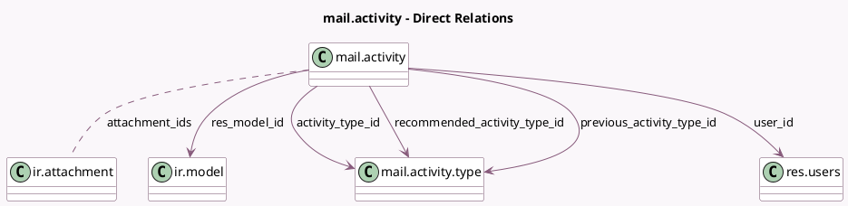

<!-- GENERATED:MODEL -->
---
tags: [odoo, community, generated, model]
---

# mail.activity

- Module: [[docs/Community Addons/mail/mail|mail]]
- Scope: Community Addons
- Defined in module: yes
- Source files: `models/mail_activity.py`
- Python classes: `MailActivity`
- Description: Activity

## Field footprint

- Detected fields: 25
- Field types: `Boolean` x 4, `Char` x 4, `Date` x 2, `Html` x 1, `Many2many` x 2, `Many2one` x 5, `Many2oneReference` x 1, `Selection` x 5, `Text` x 1
- Relation fields: 7

## Sample fields

- `active`: `Boolean`
- `activity_category`: `Selection` (related `activity_type_id.category`)
- `activity_decoration`: `Selection` (related `activity_type_id.decoration_type`)
- `activity_type_id`: `Many2one` (comodel `mail.activity.type`)
- `attachment_ids`: `Many2many` (comodel `ir.attachment`)
- `automated`: `Boolean` (comodel `Automated activity`)
- `can_write`: `Boolean` (compute `_compute_can_write`)
- `chaining_type`: `Selection` (related `activity_type_id.chaining_type`)
- `date_deadline`: `Date` (comodel `Due Date`)
- `date_done`: `Date` (comodel `Done Date`, compute `_compute_date_done`, store `True`)
- `feedback`: `Text` (comodel `Feedback`)
- `has_recommended_activities`: `Boolean` (comodel `Next activities available`, compute `_compute_has_recommended_activities`)
- `icon`: `Char` (comodel `Icon`, related `activity_type_id.icon`)
- `mail_template_ids`: `Many2many` (related `activity_type_id.mail_template_ids`)
- `note`: `Html` (comodel `Note`)
- `previous_activity_type_id`: `Many2one` (comodel `mail.activity.type`)
- `recommended_activity_type_id`: `Many2one` (comodel `mail.activity.type`)
- `res_id`: `Many2oneReference`
- `res_model`: `Char` (comodel `Related Document Model`, related `res_model_id.model`, store `True`)
- `res_model_id`: `Many2one` (comodel `ir.model`)

## Method hints

- Detected methods: 38
- Action methods: `action_cancel`, `action_close_dialog`, `action_done`, `action_done_redirect_to_other`, `action_done_schedule_next`, `action_feedback`, `action_feedback_schedule_next`, `action_notify`, and 4 more
- Compute methods: `_compute_can_write`, `_compute_date_done`, `_compute_display_name`, `_compute_has_recommended_activities`, `_compute_res_name`, `_compute_state`, `_compute_state_from_date`
- Onchange methods: `_compute_has_recommended_activities`, `_onchange_activity_type_id`, `_onchange_previous_activity_type_id`, `_onchange_recommended_activity_type_id`

## Direct relation diagram

## Navigation

- **Parent:** [[docs/Community Addons/mail/Models]]

<!-- GENERATED:MODEL -->
