<!-- GENERATED:MODEL -->
---
tags: [odoo, community, generated, model]
---

# mail.activity.mixin

- Module: [[docs/Community Addons/mail/mail|mail]]
- Scope: Community Addons
- Defined in module: yes
- Source files: `models/mail_activity_mixin.py`
- Python classes: `MailActivityMixin`
- Description: Activity Mixin

## Field footprint

- Detected fields: 10
- Field types: `Char` x 3, `Date` x 2, `Many2one` x 2, `One2many` x 1, `Selection` x 2
- Relation fields: 3

## Sample fields

- `activity_date_deadline`: `Date` (comodel `Next Activity Deadline`, compute `_compute_activity_date_deadline`, store `False`)
- `activity_exception_decoration`: `Selection` (compute `_compute_activity_exception_type`)
- `activity_exception_icon`: `Char` (comodel `Icon`, compute `_compute_activity_exception_type`)
- `activity_ids`: `One2many` (comodel `mail.activity`)
- `activity_state`: `Selection` (compute `_compute_activity_state`)
- `activity_summary`: `Char` (comodel `Next Activity Summary`, related `activity_ids.summary`)
- `activity_type_icon`: `Char` (comodel `Activity Type Icon`, related `activity_ids.icon`)
- `activity_type_id`: `Many2one` (comodel `mail.activity.type`, related `activity_ids.activity_type_id`)
- `activity_user_id`: `Many2one` (comodel `res.users`, compute `_compute_activity_user_id`)
- `my_activity_date_deadline`: `Date` (comodel `My Activity Deadline`, compute `_compute_my_activity_date_deadline`)

## Method hints

- Detected methods: 24
- Action methods: `action_reschedule_my_next_nextweek`, `action_reschedule_my_next_today`, `action_reschedule_my_next_tomorrow`
- Compute methods: `_compute_activity_date_deadline`, `_compute_activity_exception_type`, `_compute_activity_state`, `_compute_activity_user_id`, `_compute_my_activity_date_deadline`
- Onchange methods: none

## Direct relation diagram

```plantuml
@startuml
!define ODOO_COLOR_PRIMARY #714B67
!define ODOO_COLOR_ACCENT #875A7B
!define ODOO_COLOR_BG #FAF7FA

skinparam backgroundColor ODOO_COLOR_BG
skinparam defaultTextAlignment left
skinparam ArrowColor ODOO_COLOR_ACCENT
skinparam ClassBackgroundColor white
skinparam ClassBorderColor ODOO_COLOR_PRIMARY
skinparam ComponentBackgroundColor white
skinparam ComponentBorderColor ODOO_COLOR_PRIMARY
skinparam NoteBackgroundColor #FFF8FF
skinparam NoteBorderColor ODOO_COLOR_ACCENT
skinparam SequenceLifeLineBorderColor ODOO_COLOR_ACCENT
skinparam SequenceLifeLineBackgroundColor #FFFFFF
skinparam SequenceParticipantBorderColor ODOO_COLOR_PRIMARY
skinparam SequenceParticipantBackgroundColor #FFFFFF
skinparam sequence {
  ArrowColor ODOO_COLOR_ACCENT
  ActorBorderColor ODOO_COLOR_PRIMARY
}
title mail.activity.mixin - Direct Relations
class "mail.activity.mixin" as mail_activity_mixin
class "mail.activity" as mail_activity
class "mail.activity.type" as mail_activity_type
class "res.users" as res_users
mail_activity_mixin --|> mail_activity : activity_ids
mail_activity_mixin --> res_users : activity_user_id
mail_activity_mixin --> mail_activity_type : activity_type_id
@enduml
```

## Navigation

- **Parent:** [[docs/Community Addons/mail/Models]]

<!-- GENERATED:MODEL -->
