<!-- GENERATED:MODEL -->
---
tags: [odoo, community, generated, model]
---

# mail.activity.plan

- Module: [[docs/Community Addons/mail/mail|mail]]
- Scope: Community Addons
- Defined in module: yes
- Source files: `models/mail_activity_plan.py`
- Python classes: `MailActivityPlan`
- Description: Activity Plan

## Field footprint

- Detected fields: 8
- Field types: `Boolean` x 2, `Char` x 1, `Integer` x 1, `Many2one` x 2, `One2many` x 1, `Selection` x 1
- Relation fields: 3

## Sample fields

- `active`: `Boolean`
- `company_id`: `Many2one` (comodel `res.company`)
- `has_user_on_demand`: `Boolean` (comodel `Has on demand responsible`, compute `_compute_has_user_on_demand`)
- `name`: `Char` (comodel `Name`)
- `res_model`: `Selection`
- `res_model_id`: `Many2one` (comodel `ir.model`, compute `_compute_res_model_id`, store `True`)
- `steps_count`: `Integer` (compute `_compute_steps_count`)
- `template_ids`: `One2many` (comodel `mail.activity.plan.template`)

## Method hints

- Detected methods: 6
- Action methods: none
- Compute methods: `_compute_has_user_on_demand`, `_compute_res_model_id`, `_compute_steps_count`
- Onchange methods: none

## Direct relation diagram

```plantuml
@startuml
!define ODOO_COLOR_PRIMARY #714B67
!define ODOO_COLOR_ACCENT #875A7B
!define ODOO_COLOR_BG #FAF7FA

skinparam backgroundColor ODOO_COLOR_BG
skinparam defaultTextAlignment left
skinparam ArrowColor ODOO_COLOR_ACCENT
skinparam ClassBackgroundColor white
skinparam ClassBorderColor ODOO_COLOR_PRIMARY
skinparam ComponentBackgroundColor white
skinparam ComponentBorderColor ODOO_COLOR_PRIMARY
skinparam NoteBackgroundColor #FFF8FF
skinparam NoteBorderColor ODOO_COLOR_ACCENT
skinparam SequenceLifeLineBorderColor ODOO_COLOR_ACCENT
skinparam SequenceLifeLineBackgroundColor #FFFFFF
skinparam SequenceParticipantBorderColor ODOO_COLOR_PRIMARY
skinparam SequenceParticipantBackgroundColor #FFFFFF
skinparam sequence {
  ArrowColor ODOO_COLOR_ACCENT
  ActorBorderColor ODOO_COLOR_PRIMARY
}
title mail.activity.plan - Direct Relations
class "mail.activity.plan" as mail_activity_plan
class "ir.model" as ir_model
class "mail.activity.plan.template" as mail_activity_plan_template
class "res.company" as res_company
mail_activity_plan --> res_company : company_id
mail_activity_plan --|> mail_activity_plan_template : template_ids
mail_activity_plan --> ir_model : res_model_id
@enduml
```

## Navigation

- **Parent:** [[docs/Community Addons/mail/Models]]

<!-- GENERATED:MODEL -->
