<!-- GENERATED:MODEL -->
---
tags: [odoo, community, generated, model]
---

# mail.activity.plan.template

- Module: [[docs/Community Addons/mail/mail|mail]]
- Scope: Community Addons
- Defined in module: yes
- Source files: `models/mail_activity_plan_template.py`
- Python classes: `MailActivityPlanTemplate`
- Description: Activity plan template

## Field footprint

- Detected fields: 14
- Field types: `Char` x 2, `Html` x 1, `Integer` x 2, `Many2many` x 1, `Many2one` x 4, `Selection` x 4
- Relation fields: 5

## Sample fields

- `activity_type_id`: `Many2one` (comodel `mail.activity.type`)
- `company_id`: `Many2one` (related `plan_id.company_id`)
- `delay_count`: `Integer` (comodel `Interval`)
- `delay_from`: `Selection`
- `delay_unit`: `Selection`
- `icon`: `Char` (comodel `Icon`, related `activity_type_id.icon`)
- `next_activity_ids`: `Many2many` (comodel `mail.activity.type`, compute `_compute_next_activity_ids`, store `True`)
- `note`: `Html` (comodel `Note`, compute `_compute_note`, store `True`)
- `plan_id`: `Many2one` (comodel `mail.activity.plan`)
- `res_model`: `Selection` (related `plan_id.res_model`)
- `responsible_id`: `Many2one` (comodel `res.users`, compute `_compute_responsible_id`, store `True`)
- `responsible_type`: `Selection` (compute `_compute_responsible_type`, store `True`)
- `sequence`: `Integer`
- `summary`: `Char` (comodel `Summary`, compute `_compute_summary`, store `True`)

## Method hints

- Detected methods: 9
- Action methods: none
- Compute methods: `_compute_next_activity_ids`, `_compute_note`, `_compute_responsible_id`, `_compute_responsible_type`, `_compute_summary`
- Onchange methods: none

## Direct relation diagram

```plantuml
@startuml
!define ODOO_COLOR_PRIMARY #714B67
!define ODOO_COLOR_ACCENT #875A7B
!define ODOO_COLOR_BG #FAF7FA

skinparam backgroundColor ODOO_COLOR_BG
skinparam defaultTextAlignment left
skinparam ArrowColor ODOO_COLOR_ACCENT
skinparam ClassBackgroundColor white
skinparam ClassBorderColor ODOO_COLOR_PRIMARY
skinparam ComponentBackgroundColor white
skinparam ComponentBorderColor ODOO_COLOR_PRIMARY
skinparam NoteBackgroundColor #FFF8FF
skinparam NoteBorderColor ODOO_COLOR_ACCENT
skinparam SequenceLifeLineBorderColor ODOO_COLOR_ACCENT
skinparam SequenceLifeLineBackgroundColor #FFFFFF
skinparam SequenceParticipantBorderColor ODOO_COLOR_PRIMARY
skinparam SequenceParticipantBackgroundColor #FFFFFF
skinparam sequence {
  ArrowColor ODOO_COLOR_ACCENT
  ActorBorderColor ODOO_COLOR_PRIMARY
}
title mail.activity.plan.template - Direct Relations
class "mail.activity.plan.template" as mail_activity_plan_template
class "mail.activity.plan" as mail_activity_plan
class "mail.activity.type" as mail_activity_type
class "res.users" as res_users
mail_activity_plan_template --> mail_activity_plan : plan_id
mail_activity_plan_template --> mail_activity_type : activity_type_id
mail_activity_plan_template --> res_users : responsible_id
mail_activity_plan_template .. mail_activity_type : next_activity_ids
@enduml
```

## Navigation

- **Parent:** [[docs/Community Addons/mail/Models]]

<!-- GENERATED:MODEL -->
