<!-- GENERATED:MODEL -->
---
tags: [odoo, community, generated, model]
---

# mail.activity.schedule.line

- Module: [[docs/Community Addons/mail/mail|mail]]
- Scope: Community Addons
- Defined in module: yes
- Source files: `wizard/mail_activity_schedule_summary.py`
- Python classes: `MailActivityScheduleSummary`
- Description: Mail Activity Schedule Line

## Field footprint

- Detected fields: 4
- Field types: `Char` x 1, `Date` x 1, `Many2one` x 2
- Relation fields: 2

## Sample fields

- `activity_schedule_id`: `Many2one` (comodel `mail.activity.schedule`)
- `line_date_deadline`: `Date` (comodel `Date Deadline`)
- `line_description`: `Char` (comodel `Line Description`)
- `responsible_user_id`: `Many2one` (comodel `res.users`)

## Method hints

- Detected methods: 0
- Action methods: none
- Compute methods: none
- Onchange methods: none

## Direct relation diagram

```plantuml
@startuml
!define ODOO_COLOR_PRIMARY #714B67
!define ODOO_COLOR_ACCENT #875A7B
!define ODOO_COLOR_BG #FAF7FA

skinparam backgroundColor ODOO_COLOR_BG
skinparam defaultTextAlignment left
skinparam ArrowColor ODOO_COLOR_ACCENT
skinparam ClassBackgroundColor white
skinparam ClassBorderColor ODOO_COLOR_PRIMARY
skinparam ComponentBackgroundColor white
skinparam ComponentBorderColor ODOO_COLOR_PRIMARY
skinparam NoteBackgroundColor #FFF8FF
skinparam NoteBorderColor ODOO_COLOR_ACCENT
skinparam SequenceLifeLineBorderColor ODOO_COLOR_ACCENT
skinparam SequenceLifeLineBackgroundColor #FFFFFF
skinparam SequenceParticipantBorderColor ODOO_COLOR_PRIMARY
skinparam SequenceParticipantBackgroundColor #FFFFFF
skinparam sequence {
  ArrowColor ODOO_COLOR_ACCENT
  ActorBorderColor ODOO_COLOR_PRIMARY
}
title mail.activity.schedule.line - Direct Relations
class "mail.activity.schedule.line" as mail_activity_schedule_line
class "mail.activity.schedule" as mail_activity_schedule
class "res.users" as res_users
mail_activity_schedule_line --> mail_activity_schedule : activity_schedule_id
mail_activity_schedule_line --> res_users : responsible_user_id
@enduml
```

## Navigation

- **Parent:** [[docs/Community Addons/mail/Models]]

<!-- GENERATED:MODEL -->
