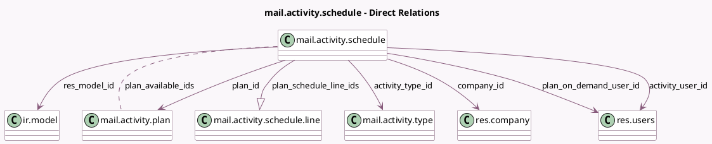

<!-- GENERATED:MODEL -->
---
tags: [odoo, community, generated, model]
---

# mail.activity.schedule

- Module: [[docs/Community Addons/mail/mail|mail]]
- Scope: Community Addons
- Defined in module: yes
- Source files: `wizard/mail_activity_schedule.py`
- Python classes: `MailActivitySchedule`
- Description: Activity schedule plan Wizard

## Field footprint

- Detected fields: 22
- Field types: `Boolean` x 4, `Char` x 2, `Date` x 2, `Html` x 3, `Many2many` x 1, `Many2one` x 6, `One2many` x 1, `Selection` x 2, `Text` x 1
- Relation fields: 8

## Sample fields

- `activity_category`: `Selection` (related `activity_type_id.category`)
- `activity_type_id`: `Many2one` (comodel `mail.activity.type`, compute `_compute_activity_type_id`, store `True`)
- `activity_user_id`: `Many2one` (comodel `res.users`, compute `_compute_activity_user_id`, store `True`)
- `chaining_type`: `Selection` (related `activity_type_id.chaining_type`)
- `company_id`: `Many2one` (comodel `res.company`, compute `_compute_company_id`)
- `date_deadline`: `Date` (comodel `Due Date`, compute `_compute_date_deadline`, store `True`)
- `error`: `Html` (compute `_compute_error`)
- `has_error`: `Boolean` (compute `_compute_error`)
- `has_warning`: `Boolean` (compute `_compute_error`)
- `is_batch_mode`: `Boolean` (comodel `Use in batch`, compute `_compute_is_batch_mode`)
- `note`: `Html` (comodel `Note`, compute `_compute_note`, store `True`)
- `plan_available_ids`: `Many2many` (comodel `mail.activity.plan`, compute `_compute_plan_available_ids`, store `True`)
- `plan_date`: `Date` (comodel `Plan Date`, compute `_compute_plan_date`, store `True`)
- `plan_has_user_on_demand`: `Boolean` (related `plan_id.has_user_on_demand`)
- `plan_id`: `Many2one` (comodel `mail.activity.plan`, compute `_compute_plan_id`, store `True`)
- `plan_on_demand_user_id`: `Many2one` (comodel `res.users`)
- `plan_schedule_line_ids`: `One2many` (comodel `mail.activity.schedule.line`, compute `_compute_plan_schedule_line_ids`)
- `res_ids`: `Text` (comodel `Document IDs`, compute `_compute_res_ids`, store `True`)
- `res_model`: `Char` (comodel `Model`)
- `res_model_id`: `Many2one` (comodel `ir.model`, compute `_compute_res_model_id`, store `True`)

## Method hints

- Detected methods: 31
- Action methods: `action_schedule_activities`, `action_schedule_activities_done`, `action_schedule_plan`
- Compute methods: `_compute_activity_type_id`, `_compute_activity_user_id`, `_compute_company_id`, `_compute_date_deadline`, `_compute_error`, `_compute_is_batch_mode`, `_compute_note`, `_compute_plan_available_ids`, and 6 more
- Onchange methods: `_onchange_activity_type_id`, `_onchange_plan_id`

## Direct relation diagram

## Navigation

- **Parent:** [[docs/Community Addons/mail/Models]]

<!-- GENERATED:MODEL -->
