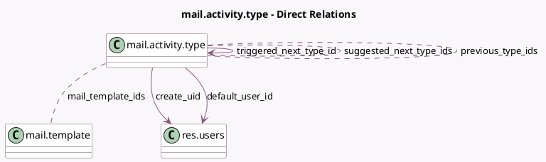

<!-- GENERATED:MODEL -->
---
tags: [odoo, community, generated, model]
---

# mail.activity.type

- Module: [[docs/Community Addons/mail/mail|mail]]
- Scope: Community Addons
- Defined in module: yes
- Source files: `models/mail_activity_type.py`
- Python classes: `MailActivityType`
- Description: Activity Type

## Field footprint

- Detected fields: 22
- Field types: `Boolean` x 2, `Char` x 4, `Html` x 1, `Integer` x 2, `Many2many` x 3, `Many2one` x 3, `Selection` x 7
- Relation fields: 6

## Sample fields

- `active`: `Boolean`
- `category`: `Selection`
- `chaining_type`: `Selection`
- `create_uid`: `Many2one` (comodel `res.users`)
- `decoration_type`: `Selection`
- `default_note`: `Html`
- `default_user_id`: `Many2one` (comodel `res.users`)
- `delay_count`: `Integer` (comodel `Schedule`)
- `delay_from`: `Selection`
- `delay_label`: `Char` (compute `_compute_delay_label`)
- `delay_unit`: `Selection`
- `icon`: `Char` (comodel `Icon`)
- `initial_res_model`: `Selection` (compute `_compute_initial_res_model`, store `False`)
- `mail_template_ids`: `Many2many` (comodel `mail.template`)
- `name`: `Char` (comodel `Name`)
- `previous_type_ids`: `Many2many` (comodel `mail.activity.type`)
- `res_model`: `Selection`
- `res_model_change`: `Boolean` (store `False`)
- `sequence`: `Integer` (comodel `Sequence`)
- `suggested_next_type_ids`: `Many2many` (comodel `mail.activity.type`, compute `_compute_suggested_next_type_ids`, store `True`)

## Method hints

- Detected methods: 15
- Action methods: `action_archive`
- Compute methods: `_compute_delay_label`, `_compute_initial_res_model`, `_compute_suggested_next_type_ids`, `_compute_triggered_next_type_id`
- Onchange methods: `_onchange_res_model`

## Direct relation diagram

## Navigation

- **Parent:** [[docs/Community Addons/mail/Models]]

<!-- GENERATED:MODEL -->
