<!-- GENERATED:MODEL -->
---
tags: [odoo, community, generated, model]
---

# mail.alias.domain

- Module: [[docs/Community Addons/mail/mail|mail]]
- Scope: Community Addons
- Defined in module: yes
- Source files: `models/mail_alias_domain.py`
- Python classes: `MailAliasDomain`
- Description: Email Domain

## Field footprint

- Detected fields: 9
- Field types: `Char` x 7, `Integer` x 1, `One2many` x 1
- Relation fields: 1

## Sample fields

- `bounce_alias`: `Char` (comodel `Bounce Alias`)
- `bounce_email`: `Char` (comodel `Bounce Email`, compute `_compute_bounce_email`)
- `catchall_alias`: `Char` (comodel `Catchall Alias`)
- `catchall_email`: `Char` (comodel `Catchall Email`, compute `_compute_catchall_email`)
- `company_ids`: `One2many` (comodel `res.company`)
- `default_from`: `Char` (comodel `Default From Alias`)
- `default_from_email`: `Char` (comodel `Default From`, compute `_compute_default_from_email`)
- `name`: `Char` (comodel `Name`)
- `sequence`: `Integer`

## Method hints

- Detected methods: 11
- Action methods: none
- Compute methods: `_compute_bounce_email`, `_compute_catchall_email`, `_compute_default_from_email`
- Onchange methods: none

## Direct relation diagram

```plantuml
@startuml
!define ODOO_COLOR_PRIMARY #714B67
!define ODOO_COLOR_ACCENT #875A7B
!define ODOO_COLOR_BG #FAF7FA

skinparam backgroundColor ODOO_COLOR_BG
skinparam defaultTextAlignment left
skinparam ArrowColor ODOO_COLOR_ACCENT
skinparam ClassBackgroundColor white
skinparam ClassBorderColor ODOO_COLOR_PRIMARY
skinparam ComponentBackgroundColor white
skinparam ComponentBorderColor ODOO_COLOR_PRIMARY
skinparam NoteBackgroundColor #FFF8FF
skinparam NoteBorderColor ODOO_COLOR_ACCENT
skinparam SequenceLifeLineBorderColor ODOO_COLOR_ACCENT
skinparam SequenceLifeLineBackgroundColor #FFFFFF
skinparam SequenceParticipantBorderColor ODOO_COLOR_PRIMARY
skinparam SequenceParticipantBackgroundColor #FFFFFF
skinparam sequence {
  ArrowColor ODOO_COLOR_ACCENT
  ActorBorderColor ODOO_COLOR_PRIMARY
}
title mail.alias.domain - Direct Relations
class "mail.alias.domain" as mail_alias_domain
class "res.company" as res_company
mail_alias_domain --|> res_company : company_ids
@enduml
```

## Navigation

- **Parent:** [[docs/Community Addons/mail/Models]]

<!-- GENERATED:MODEL -->
