<!-- GENERATED:MODEL -->
---
tags: [odoo, community, generated, model]
---

# mail.alias

- Module: [[docs/Community Addons/mail/mail|mail]]
- Scope: Community Addons
- Defined in module: yes
- Source files: `models/mail_alias.py`
- Python classes: `MailAlias`
- Description: Email Aliases

## Field footprint

- Detected fields: 13
- Field types: `Boolean` x 1, `Char` x 3, `Html` x 1, `Integer` x 2, `Many2one` x 3, `Selection` x 2, `Text` x 1
- Relation fields: 3

## Sample fields

- `alias_bounced_content`: `Html` (comodel `Custom Bounced Message`)
- `alias_contact`: `Selection`
- `alias_defaults`: `Text` (comodel `Default Values`)
- `alias_domain`: `Char` (comodel `Alias domain name`, related `alias_domain_id.name`)
- `alias_domain_id`: `Many2one` (comodel `mail.alias.domain`)
- `alias_force_thread_id`: `Integer` (comodel `Record Thread ID`)
- `alias_full_name`: `Char` (comodel `Alias Email`, compute `_compute_alias_full_name`, store `True`)
- `alias_incoming_local`: `Boolean` (comodel `Local-part based incoming detection`)
- `alias_model_id`: `Many2one` (comodel `ir.model`)
- `alias_name`: `Char` (comodel `Alias Name`)
- `alias_parent_model_id`: `Many2one` (comodel `ir.model`)
- `alias_parent_thread_id`: `Integer` (comodel `Parent Record Thread ID`)
- `alias_status`: `Selection` (compute `_compute_alias_status`, store `True`)

## Method hints

- Detected methods: 20
- Action methods: none
- Compute methods: `_compute_alias_full_name`, `_compute_alias_status`, `_compute_display_name`
- Onchange methods: none

## Direct relation diagram

```plantuml
@startuml
!define ODOO_COLOR_PRIMARY #714B67
!define ODOO_COLOR_ACCENT #875A7B
!define ODOO_COLOR_BG #FAF7FA

skinparam backgroundColor ODOO_COLOR_BG
skinparam defaultTextAlignment left
skinparam ArrowColor ODOO_COLOR_ACCENT
skinparam ClassBackgroundColor white
skinparam ClassBorderColor ODOO_COLOR_PRIMARY
skinparam ComponentBackgroundColor white
skinparam ComponentBorderColor ODOO_COLOR_PRIMARY
skinparam NoteBackgroundColor #FFF8FF
skinparam NoteBorderColor ODOO_COLOR_ACCENT
skinparam SequenceLifeLineBorderColor ODOO_COLOR_ACCENT
skinparam SequenceLifeLineBackgroundColor #FFFFFF
skinparam SequenceParticipantBorderColor ODOO_COLOR_PRIMARY
skinparam SequenceParticipantBackgroundColor #FFFFFF
skinparam sequence {
  ArrowColor ODOO_COLOR_ACCENT
  ActorBorderColor ODOO_COLOR_PRIMARY
}
title mail.alias - Direct Relations
class "mail.alias" as mail_alias
class "ir.model" as ir_model
class "mail.alias.domain" as mail_alias_domain
mail_alias --> mail_alias_domain : alias_domain_id
mail_alias --> ir_model : alias_model_id
mail_alias --> ir_model : alias_parent_model_id
@enduml
```

## Navigation

- **Parent:** [[docs/Community Addons/mail/Models]]

<!-- GENERATED:MODEL -->
