<!-- GENERATED:MODEL -->
---
tags: [odoo, community, generated, model]
---

# mail.alias.mixin.optional

- Module: [[docs/Community Addons/mail/mail|mail]]
- Scope: Community Addons
- Defined in module: yes
- Source files: `models/mail_alias_mixin_optional.py`
- Python classes: `MailAliasMixinOptional`
- Description: Email Aliases Mixin (light)

## Field footprint

- Detected fields: 6
- Field types: `Char` x 3, `Many2one` x 2, `Text` x 1
- Relation fields: 2

## Sample fields

- `alias_defaults`: `Text` (related `alias_id.alias_defaults`)
- `alias_domain`: `Char` (comodel `Alias Domain Name`, related `alias_id.alias_domain`)
- `alias_domain_id`: `Many2one` (comodel `mail.alias.domain`, related `alias_id.alias_domain_id`)
- `alias_email`: `Char` (comodel `Email Alias`, compute `_compute_alias_email`)
- `alias_id`: `Many2one` (comodel `mail.alias`)
- `alias_name`: `Char` (related `alias_id.alias_name`)

## Method hints

- Detected methods: 10
- Action methods: none
- Compute methods: `_compute_alias_email`
- Onchange methods: none

## Direct relation diagram

```plantuml
@startuml
!define ODOO_COLOR_PRIMARY #714B67
!define ODOO_COLOR_ACCENT #875A7B
!define ODOO_COLOR_BG #FAF7FA

skinparam backgroundColor ODOO_COLOR_BG
skinparam defaultTextAlignment left
skinparam ArrowColor ODOO_COLOR_ACCENT
skinparam ClassBackgroundColor white
skinparam ClassBorderColor ODOO_COLOR_PRIMARY
skinparam ComponentBackgroundColor white
skinparam ComponentBorderColor ODOO_COLOR_PRIMARY
skinparam NoteBackgroundColor #FFF8FF
skinparam NoteBorderColor ODOO_COLOR_ACCENT
skinparam SequenceLifeLineBorderColor ODOO_COLOR_ACCENT
skinparam SequenceLifeLineBackgroundColor #FFFFFF
skinparam SequenceParticipantBorderColor ODOO_COLOR_PRIMARY
skinparam SequenceParticipantBackgroundColor #FFFFFF
skinparam sequence {
  ArrowColor ODOO_COLOR_ACCENT
  ActorBorderColor ODOO_COLOR_PRIMARY
}
title mail.alias.mixin.optional - Direct Relations
class "mail.alias.mixin.optional" as mail_alias_mixin_optional
class "mail.alias" as mail_alias
class "mail.alias.domain" as mail_alias_domain
mail_alias_mixin_optional --> mail_alias : alias_id
mail_alias_mixin_optional --> mail_alias_domain : alias_domain_id
@enduml
```

## Navigation

- **Parent:** [[docs/Community Addons/mail/Models]]

<!-- GENERATED:MODEL -->
