<!-- GENERATED:MODEL -->
---
tags: [odoo, community, generated, model]
---

# mail.canned.response

- Module: [[docs/Community Addons/mail/mail|mail]]
- Scope: Community Addons
- Defined in module: yes
- Source files: `models/mail_canned_response.py`
- Python classes: `MailCannedResponse`
- Description: Canned Response

## Field footprint

- Detected fields: 6
- Field types: `Boolean` x 2, `Char` x 1, `Datetime` x 1, `Many2many` x 1, `Text` x 1
- Relation fields: 1

## Sample fields

- `group_ids`: `Many2many` (comodel `res.groups`)
- `is_editable`: `Boolean` (compute `_compute_is_editable`)
- `is_shared`: `Boolean` (compute `_compute_is_shared`, store `True`)
- `last_used`: `Datetime` (comodel `Last Used`)
- `source`: `Char` (comodel `Shortcut`)
- `substitution`: `Text` (comodel `Substitution`)

## Method hints

- Detected methods: 7
- Action methods: none
- Compute methods: `_compute_is_editable`, `_compute_is_shared`
- Onchange methods: none

## Direct relation diagram

```plantuml
@startuml
!define ODOO_COLOR_PRIMARY #714B67
!define ODOO_COLOR_ACCENT #875A7B
!define ODOO_COLOR_BG #FAF7FA

skinparam backgroundColor ODOO_COLOR_BG
skinparam defaultTextAlignment left
skinparam ArrowColor ODOO_COLOR_ACCENT
skinparam ClassBackgroundColor white
skinparam ClassBorderColor ODOO_COLOR_PRIMARY
skinparam ComponentBackgroundColor white
skinparam ComponentBorderColor ODOO_COLOR_PRIMARY
skinparam NoteBackgroundColor #FFF8FF
skinparam NoteBorderColor ODOO_COLOR_ACCENT
skinparam SequenceLifeLineBorderColor ODOO_COLOR_ACCENT
skinparam SequenceLifeLineBackgroundColor #FFFFFF
skinparam SequenceParticipantBorderColor ODOO_COLOR_PRIMARY
skinparam SequenceParticipantBackgroundColor #FFFFFF
skinparam sequence {
  ArrowColor ODOO_COLOR_ACCENT
  ActorBorderColor ODOO_COLOR_PRIMARY
}
title mail.canned.response - Direct Relations
class "mail.canned.response" as mail_canned_response
class "res.groups" as res_groups
mail_canned_response .. res_groups : group_ids
@enduml
```

## Navigation

- **Parent:** [[docs/Community Addons/mail/Models]]

<!-- GENERATED:MODEL -->
