<!-- GENERATED:MODEL -->
---
tags: [odoo, community, generated, model]
---

# mail.compose.message

- Module: [[docs/Community Addons/mail/mail|mail]]
- Scope: Community Addons
- Defined in module: yes
- Source files: `wizard/mail_compose_message.py`
- Python classes: `MailComposeMessage`
- Description: Email composition wizard
- Inherits: `mail.composer.mixin`

## Field footprint

- Detected fields: 39
- Field types: `Boolean` x 14, `Char` x 7, `Html` x 1, `Many2many` x 2, `Many2one` x 9, `Selection` x 4, `Text` x 2
- Relation fields: 11

## Sample fields

- `attachment_ids`: `Many2many` (comodel `ir.attachment`, compute `_compute_attachment_ids`, store `True`)
- `author_id`: `Many2one` (comodel `res.partner`, compute `_compute_authorship`, store `True`)
- `auto_delete`: `Boolean` (comodel `Delete Emails`, compute `_compute_auto_delete`, store `True`)
- `auto_delete_keep_log`: `Boolean` (comodel `Keep Message Copy`, compute `_compute_auto_delete_keep_log`, store `True`)
- `body`: `Html` (comodel `Contents`, compute `_compute_body`, store `True`)
- `composition_batch`: `Boolean` (comodel `Batch composition`, compute `_compute_composition_batch`)
- `composition_comment_option`: `Selection`
- `composition_mode`: `Selection`
- `email_add_signature`: `Boolean` (comodel `Add signature`, compute `_compute_email_add_signature`, store `True`)
- `email_from`: `Char` (comodel `From`, compute `_compute_authorship`, store `True`)
- `email_layout_xmlid`: `Char` (comodel `Email Notification Layout`, compute `_compute_email_layout_xmlid`, store `True`)
- `force_send`: `Boolean` (comodel `Send mailing or notifications directly`, compute `_compute_force_send`, store `True`)
- `mail_activity_type_id`: `Many2one` (comodel `mail.activity.type`)
- `mail_server_id`: `Many2one` (comodel `ir.mail_server`, compute `_compute_mail_server_id`, store `True`)
- `message_type`: `Selection`
- `model`: `Char` (comodel `Related Document Model`, compute `_compute_model`, store `True`)
- `model_is_thread`: `Boolean` (comodel `Thread-Enabled`, compute `_compute_model_is_thread`)
- `notified_bcc_contains_share`: `Boolean` (comodel `Is an external partner follower of the document?`, compute `_compute_notified_bcc_contains_share`)
- `notify_author`: `Boolean` (compute `_compute_notify_author`, store `True`)
- `notify_author_mention`: `Boolean` (compute `_compute_notify_author_mention`, store `True`)

## Method hints

- Detected methods: 62
- Action methods: `action_schedule_message`, `action_send_mail`
- Compute methods: `_compute_attachment_ids`, `_compute_authorship`, `_compute_auto_delete`, `_compute_auto_delete_keep_log`, `_compute_body`, `_compute_can_edit_body`, `_compute_composition_batch`, `_compute_email_add_signature`, and 23 more
- Onchange methods: none

## Direct relation diagram

```plantuml
@startuml
!define ODOO_COLOR_PRIMARY #714B67
!define ODOO_COLOR_ACCENT #875A7B
!define ODOO_COLOR_BG #FAF7FA

skinparam backgroundColor ODOO_COLOR_BG
skinparam defaultTextAlignment left
skinparam ArrowColor ODOO_COLOR_ACCENT
skinparam ClassBackgroundColor white
skinparam ClassBorderColor ODOO_COLOR_PRIMARY
skinparam ComponentBackgroundColor white
skinparam ComponentBorderColor ODOO_COLOR_PRIMARY
skinparam NoteBackgroundColor #FFF8FF
skinparam NoteBorderColor ODOO_COLOR_ACCENT
skinparam SequenceLifeLineBorderColor ODOO_COLOR_ACCENT
skinparam SequenceLifeLineBackgroundColor #FFFFFF
skinparam SequenceParticipantBorderColor ODOO_COLOR_PRIMARY
skinparam SequenceParticipantBackgroundColor #FFFFFF
skinparam sequence {
  ArrowColor ODOO_COLOR_ACCENT
  ActorBorderColor ODOO_COLOR_PRIMARY
}
title mail.compose.message - Direct Relations
class "mail.compose.message" as mail_compose_message
class "ir.attachment" as ir_attachment
class "ir.mail_server" as ir_mail_server
class "mail.activity.type" as mail_activity_type
class "mail.alias.domain" as mail_alias_domain
class "mail.message" as mail_message
class "mail.message.subtype" as mail_message_subtype
class "mail.template" as mail_template
class "res.company" as res_company
class "res.partner" as res_partner
class "res.users" as res_users
mail_compose_message --> mail_message : parent_id
mail_compose_message --> mail_template : template_id
mail_compose_message .. ir_attachment : attachment_ids
mail_compose_message --> res_partner : author_id
mail_compose_message --> res_users : res_domain_user_id
mail_compose_message --> mail_alias_domain : record_alias_domain_id
mail_compose_message --> res_company : record_company_id
mail_compose_message --> mail_message_subtype : subtype_id
mail_compose_message --> mail_activity_type : mail_activity_type_id
mail_compose_message .. res_partner : partner_ids
mail_compose_message --> ir_mail_server : mail_server_id
@enduml
```

## Navigation

- **Parent:** [[docs/Community Addons/mail/Models]]

<!-- GENERATED:MODEL -->
