<!-- GENERATED:MODEL -->
---
tags: [odoo, community, generated, model]
---

# mail.composer.mixin

- Module: [[docs/Community Addons/mail/mail|mail]]
- Scope: Community Addons
- Defined in module: yes
- Source files: `models/mail_composer_mixin.py`
- Python classes: `MailComposerMixin`
- Description: Mail Composer Mixin
- Inherits: `mail.render.mixin`

## Field footprint

- Detected fields: 7
- Field types: `Boolean` x 3, `Char` x 2, `Html` x 1, `Many2one` x 1
- Relation fields: 1

## Sample fields

- `body`: `Html` (comodel `Contents`, compute `_compute_body`, store `True`)
- `body_has_template_value`: `Boolean` (comodel `Body content is the same as the template`, compute `_compute_body_has_template_value`)
- `can_edit_body`: `Boolean` (comodel `Can Edit Body`, compute `_compute_can_edit_body`)
- `is_mail_template_editor`: `Boolean` (comodel `Is Editor`, compute `_compute_is_mail_template_editor`)
- `lang`: `Char` (compute `_compute_lang`, store `True`)
- `subject`: `Char` (comodel `Subject`, compute `_compute_subject`, store `True`)
- `template_id`: `Many2one` (comodel `mail.template`)

## Method hints

- Detected methods: 8
- Action methods: none
- Compute methods: `_compute_body`, `_compute_body_has_template_value`, `_compute_can_edit_body`, `_compute_is_mail_template_editor`, `_compute_lang`, `_compute_subject`
- Onchange methods: none

## Direct relation diagram

```plantuml
@startuml
!define ODOO_COLOR_PRIMARY #714B67
!define ODOO_COLOR_ACCENT #875A7B
!define ODOO_COLOR_BG #FAF7FA

skinparam backgroundColor ODOO_COLOR_BG
skinparam defaultTextAlignment left
skinparam ArrowColor ODOO_COLOR_ACCENT
skinparam ClassBackgroundColor white
skinparam ClassBorderColor ODOO_COLOR_PRIMARY
skinparam ComponentBackgroundColor white
skinparam ComponentBorderColor ODOO_COLOR_PRIMARY
skinparam NoteBackgroundColor #FFF8FF
skinparam NoteBorderColor ODOO_COLOR_ACCENT
skinparam SequenceLifeLineBorderColor ODOO_COLOR_ACCENT
skinparam SequenceLifeLineBackgroundColor #FFFFFF
skinparam SequenceParticipantBorderColor ODOO_COLOR_PRIMARY
skinparam SequenceParticipantBackgroundColor #FFFFFF
skinparam sequence {
  ArrowColor ODOO_COLOR_ACCENT
  ActorBorderColor ODOO_COLOR_PRIMARY
}
title mail.composer.mixin - Direct Relations
class "mail.composer.mixin" as mail_composer_mixin
class "mail.template" as mail_template
mail_composer_mixin --> mail_template : template_id
@enduml
```

## Navigation

- **Parent:** [[docs/Community Addons/mail/Models]]

<!-- GENERATED:MODEL -->
